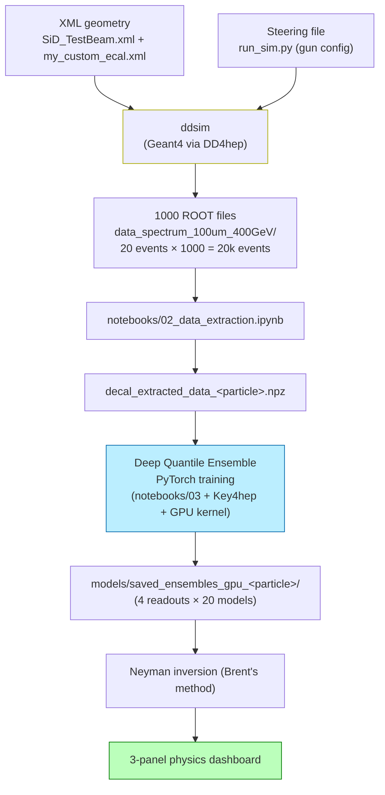

# CALOMAPS — Handbook

A comprehensive operational + conceptual guide to the CALOMAPS DECAL R&D framework. This is the document you should be able to follow end-to-end to (a) understand what you're doing and why, and (b) actually run the pipeline and produce real physics output.

The companion document [DECAL_pipeline.md](DECAL_pipeline.md) is the canonical physics writeup. This handbook overlaps it deliberately but is pitched for collaborators who will read code, modify geometry, and run simulations. For environment-level quirks (SSHFS, JupyterHub flakes, CVMFS surprises) see [troubleshooting.md](troubleshooting.md).

---

## Table of contents

1. [Project at a glance](#1-project-at-a-glance)
2. [Why DECAL? — the physics motivation](#2-why-decal--the-physics-motivation)
3. [The detector geometry, in detail](#3-the-detector-geometry-in-detail)
4. [The particle gun](#4-the-particle-gun)
5. [Pipeline overview](#5-pipeline-overview)
6. [Setting up your environment](#6-setting-up-your-environment)
7. [Storage map — where files actually live](#7-storage-map--where-files-actually-live)
8. [Running a smoke-test simulation](#8-running-a-smoke-test-simulation)
9. [Running the production simulation](#9-running-the-production-simulation)
10. [Data extraction](#10-data-extraction)
11. [Training the deep-ensemble surrogate](#11-training-the-deep-ensemble-surrogate)
12. [Neyman-inversion reconstruction](#12-neyman-inversion-reconstruction)
13. [Interpreting the 3-panel physics dashboard](#13-interpreting-the-3-panel-physics-dashboard)
14. [Common gotchas (code-level)](#14-common-gotchas-code-level)
15. [Where to ask for help](#15-where-to-ask-for-help)
16. [Optional / maintainer reference](#16-optional--maintainer-reference)

---

## 1. Project at a glance

CALOMAPS is a digital calorimeter (**DECAL**) R&D study. The pipeline:

1. Use a Geant4-based simulation (driven by DD4hep, configured by XML) to fire **photons of varying energies** into a custom electromagnetic calorimeter made of **silicon pixel layers** instead of analog pads.
2. From the raw hit data — restricted to the +y entry segment — compute four per-event readouts: **visible energy** (analog), **MIP count** (MIPs-per-pixel, `Σ max(1, round(E_pix/E_MIP))`), **raw hit count** (pixels above ½-MIP threshold, purely digital), and **cluster count** (number of 8-connected pixel clusters, summed over layers).
3. Train a **Deep Quantile Ensemble** — 20 small networks per readout, trained with Pinball loss at the 15.87 / 50 / 84.13 percentiles — to map true energy → readout, with uncertainty quantification baked in.
4. Use the trained surrogate to **reconstruct** new shower energies via a **Neyman construction** (a statistical inversion that survives the surrogate curve saturating at high energy).
5. Produce a **3-panel physics dashboard** showing linearity, resolution, and stochastic terms — the canonical way calorimeter performance is reported in the literature.

A working end-to-end run produces all 5 stages. The more interesting direction is to **change** something in the geometry (pixel size, number of layers, tungsten thickness) and watch how the dashboard changes.

---

## 2. Why DECAL? — the physics motivation

Traditional electromagnetic calorimeters measure **analog energy**: each readout cell records how much energy was deposited in it, and the cell sizes are millimeters across. DECAL ("Digital Electromagnetic Calorimeter") proposes the opposite: each cell is **tens of micrometers**, and the readout is **binary** — either the cell was hit or it wasn't. Why throw away the energy information?

The bet is that across the relevant energy range, **binary hit-counting is sometimes a better measurement than analog energy** — for two unrelated physics reasons that happen to favor digital at *different ends* of the energy spectrum.

### 2.1 The low-energy advantage: Landau tail truncation

When a charged particle traverses a thin layer of silicon, the amount of energy it deposits is **not Gaussian** — it follows a **Landau distribution**: skewed, with a heavy high-energy tail caused by rare hard-scattering events (delta rays). At low shower energies, the absolute number of charged particles passing through the silicon is modest, and the Landau fluctuations on each one dominate the total visible energy.

```
Energy deposit per MIP-passage through 320 µm Si:

freq
  |     ▄
  |    ███
  |   █████
  |  ███████
  |  █████████ ▄
  | ███████████▄
  |█████████████▄▄
  |██████████████████▄▄▄
  |████████████████████████▄▄▄▄▄▄▄▄▄
  +─────────────────────────────────→ E [keV]
       ↑
       most probable          ↑ delta-ray tail
                              (rare, large)

  Analog readout: each hit is sampled from this entire shape.
  Variance across the whole distribution → bad resolution.

  Binary readout: each hit becomes a 1, regardless of where on
  the Landau distribution it landed. The tail is silently
  truncated. Resolution improves.
```

So at low energy (say, E < 20 GeV electrons or photons), **digital wins by ignoring the Landau tail**.

### 2.2 The high-energy catastrophe: pixel saturation

At high shower energies (E > 100 GeV), the electromagnetic shower at its core becomes extraordinarily dense — *dozens* of secondary particles cross the same small silicon volume. An analog readout sums their energy contributions correctly. A binary readout records the cell as "1" regardless of how many particles crossed it — it **saturates**.

```
Hits vs true energy:

hits
counted
  |                  digital saturation
  |                   _________
  |             ____/
  |          __/
  |       __/
  |     _/
  |   _/        ← linear at low/mid E
  |  /
  | /
  |/
  +─────────────────────────────────→ E_true

  Analog readout stays linear (sums correctly).
  Digital readout flattens — adding particles
  produces no new hits past saturation.
```

So at high energy (E > 100 GeV), **digital loses by saturating** while analog stays linear.

### 2.3 The story the dashboard tells

```
                LOW E              MID E              HIGH E
              ────────           ────────           ─────────

Resolution     digital            both work          analog
(lower is      wins (Landau       roughly the        wins (no
better)        tail truncated)    same               saturation)

Linearity      both OK            both OK            digital
                                                     fails
                                                     (curve bends)
```

A central question for the project is: **at what pixel size does this trade-off look most attractive?** You can re-run the simulation at 25 µm, 50 µm, 100 µm, 200 µm pixels and watch the saturation knee move — a pitch scan of this kind is a publishable result.

The point of training a neural-network surrogate is that we want the **multiple readout views** to all be useful — and we want to combine them cleverly without making Gaussian assumptions. Pinball-loss quantile training handles asymmetric Landau-like uncertainties; ensembles handle epistemic uncertainty from limited training data.

---

## 3. The detector geometry, in detail

### 3.1 The world

The simulation universe is a single 30 m × 30 m × 30 m air-filled box. **Almost everything from the SiD reference design is commented out:** no tracker, no HCal, no muon system, no beampipe, no solenoid (B = 0 everywhere). The only physical object inside is one custom ECal barrel.

This is intentional. We want a **clean test-beam-like environment** where every Geant4 event is "photon flies through air, hits silicon-tungsten stack, makes shower." No tracker upstream means no material budget, no scattering, no field-induced curvature — just the photon and the calorimeter.

The relevant file is [`geometry/SiD_TestBeam.xml`](../geometry/SiD_TestBeam.xml). Note the long block of `<!-- <include ref="baseline_sid_o2_v03/..."/> -->` comments — those are the SiD subdetectors that are *deliberately disabled*. Do not uncomment them unless you have a reason.

The baseline SiD XML files we inherited from are at [`geometry/baseline_sid_o2_v03/`](../geometry/baseline_sid_o2_v03/) — see [`PROVENANCE.md`](../geometry/baseline_sid_o2_v03/PROVENANCE.md) there for the full upstream attribution.

### 3.2 Coordinate system

DD4hep / Geant4 use a right-handed Cartesian system:

```
                +Z  (along the beamline)
                 │
                 │
                 │     +Y
                 │   ╱  (we shoot photons in this direction)
                 │ ╱
                 ●───────── +X
              origin
              (0, 0, 0)
              "the IP"
```

For CALOMAPS we don't really have a beamline — we just have a photon gun aimed at +Y, hitting one face of the dodecagonal barrel. The barrel is rotated 15° around z so its faces (not edges) point along the cardinal axes.

### 3.3 The DECAL barrel — top-down view

Look at the barrel from above (along the +z axis). It's a 12-sided polyhedron — a dodecagon — with inner radius 1264 mm and outer radius 1403 mm:

```
       ┌───────────┐         +Y  (gun direction)
       │           │            ▲
     ╱               ╲         photon
   ╱                   ╲         │
  │                     │        │
  │                     │        │
  │      hollow        rmax=1403 mm
  │      cavity         │        │
  │     (air,           │        │
  │      where the      │        │
  │      photon         │        │
  │      flies)         │        ▼  flight path:
  │                     │       (0,0,0) → (0, +∞, 0)
  │                     │
   ╲                   ╱        Photon enters
     ╲               ╱          the barrel face
       ╲   _____   ╱            whose normal is +Y
       │           │
       └───────────┘
       rmin=1264 mm
       (12 sides, rotated 15° about z)
```

The photon flies from origin radially outward along +Y, traverses ~1264 mm of air, and slams into the silicon-tungsten stack of the face whose outward normal is +Y. **All the showers in our dataset happen on the same face**, in the same spot, because we use a pencil beam with no smearing.

The barrel extends ±1765 mm along z (half-length 1765 mm).

### 3.4 The layer stack — radial cross-section

As the photon flies outward from r=1264 mm to r=1403 mm, it crosses **30 sampling layers**, each a tungsten + silicon + readout sandwich.

```
photon direction: → +radius

r=1264 mm
   │
   ▼  ┌──── ONE THIN LAYER (× 20 repeats) ──────────────┐
      │                                                  │
      │  ╔═══════╗  2.5 mm  TungstenDens24 (absorber)   │
      │  ║░░░░░░░║                                       │
      │  ╚═══════╝                                       │
      │  ░░░░░░░░░  0.25 mm air                          │
      │  ┃▓▓▓▓▓▓▓┃  0.32 mm SILICON ← sensitive!         │
      │  ─────────  0.05 mm copper (readout)             │
      │  ─────────  0.30 mm kapton                       │
      │  ░░░░░░░░░  0.33 mm air                          │
      │                                                  │
      └──────────────────────────────────────────────────┘
                  ↓ repeat 20 times

      ┌──── ONE THICK LAYER (× 10 repeats) ─────────────┐
      │                                                  │
      │  ╔═════════════╗  5.0 mm TungstenDens24          │
      │  ║░░░░░░░░░░░░░║  (twice the absorber)           │
      │  ╚═════════════╝                                 │
      │  ░░░░░░░░░       0.25 mm air                     │
      │  ┃▓▓▓▓▓▓▓┃       0.32 mm SILICON                 │
      │  ─────────       0.05 mm copper                  │
      │  ─────────       0.30 mm kapton                  │
      │  ░░░░░░░░░       0.33 mm air                     │
      │                                                  │
      └──────────────────────────────────────────────────┘
                  ↓ repeat 10 times

   ▲
   │
r=1403 mm
```

**Why thin-then-thick?** An EM shower is densest near its maximum, which lives in the early layers. There you want fine longitudinal sampling. Deep in the shower the tail is much sparser, so thicker absorber slices are fine.

**Why 320 µm silicon?** Standard MAPS thickness. Thin enough for well-defined Landau-distributed energy deposits per MIP-crossing; thick enough for reliable detection.

**Total radiation lengths:** 20 × 2.5 mm + 10 × 5.0 mm = 100 mm of tungsten; W X₀ ≈ 3.5 mm → **~28 X₀**, plenty for EM containment.

### 3.5 Pixel segmentation

Each silicon layer is segmented into pixels of **100 µm × 100 µm** (`ECal_cell_size = 0.1*mm` in [`SiD_TestBeam.xml`](../geometry/SiD_TestBeam.xml)). Cartesian XY grid on the face of the silicon layer.

```
   +Z
    ▲
    │   ┌──┬──┬──┬──┬──┬──┬──┬──┬──┬──┬──┬──┬──┬──┐
    │   │  │  │  │  │  │  │  │  │  │  │  │  │  │  │
    │   ├──┼──┼──┼──┼──┼──┼──┼──┼──┼──┼──┼──┼──┼──┤
    │   │  │  │  │  │  │██│██│██│██│  │  │  │  │  │ ← lit pixels
    │   ├──┼──┼──┼──┼──┼██┼██┼██┼██┼──┼──┼──┼──┼──┤   from one
    │   │  │  │  │  │  │██│██│██│██│  │  │  │  │  │   shower
    │   ├──┼──┼──┼──┼──┼──┼──┼──┼──┼──┼──┼──┼──┼──┤
    │   │  │  │  │  │  │  │  │  │  │  │  │  │  │  │
    │   └──┴──┴──┴──┴──┴──┴──┴──┴──┴──┴──┴──┴──┴──┘
    │
    └────────────────────────────────────→ +X
```

Cell-coordinate bitfield: `system:5, side:-2, module:8, stave:4, layer:9, submodule:4, x:32:-16, y:-16`.

**Suggested experiment:** edit `ECal_cell_size` in [`SiD_TestBeam.xml`](../geometry/SiD_TestBeam.xml) and re-run. At what pitch does the high-energy saturation become intolerable? At what pitch does the low-energy Landau advantage disappear?

### 3.6 What a single 50 GeV photon shower actually looks like

Empirically (from a 10-event smoke run at fixed 50 GeV):

| Observable | Value | Comment |
|---|---|---|
| Geant4 wall time per event | ~0.9 s | Mostly EM shower simulation |
| Hits per event | ~6,000–8,500 (mean ≈ 7,700) | One "hit" = one pixel with non-zero energy |
| Total visible energy per shower | ~0.7 GeV out of 50 GeV true | **Sampling fraction ≈ 1.4%** (measured from data, not a fixed target — it depends on the Si/W thickness ratio; most energy is absorbed in the W) |
| Energy per hit | 3 neV — 5 MeV | Landau-shaped — most hits are MIP-like |
| Hit y-range | **[−1316, +1401] mm** | Spans both the +Y entry face *and* the −Y exit face |

**Why hits on the opposite face?** A 50 GeV EM shower is roughly 95% contained in 28 X₀. The remaining ~5% (and many soft secondaries) escape *into* the air cavity inside the dodecagon, fly across, and strike the **opposite face**. So a single shower deposits hits on both the entry face and (less so) the exit face.

The extraction in `notebooks/02_data_extraction.ipynb` isolates the **entry segment** — the one dodecagon face the beam enters — keeping only hits in a ±15° wedge around +y at the silicon radius:
```python
ang = np.degrees(np.arctan2(x, y))                    # angle from +y in the x-y plane
seg = (np.abs(ang) < 15) & (r > 1264 - 4) & (r < 1403 + 14)   # r = hypot(x, y)
```
This is deliberate: a real measurement reads out the module the beam enters, and isolating the segment excludes the cross-cavity leakage (an artifact of this closed test geometry, not of the calorimeter technology). To study leakage instead, widen the wedge or drop the angular cut.

### 3.7 Geometry summary (cheat sheet)

| Quantity | Value | Source |
|---|---|---|
| Inner radius | 1264 mm | `ECalBarrel_rmin` in `SiD_TestBeam.xml` |
| Outer radius | 1403 mm | `ECalBarrel_rmax` |
| Half-length z | 1765 mm | `ECalBarrel_half_length` |
| Symmetry | 12-fold (dodecagon) | `ECalBarrel_symmetry` |
| Thin layers | 20 × (2.5 mm W + 320 µm Si + readout) | `my_custom_ecal.xml` |
| Thick layers | 10 × (5.0 mm W + 320 µm Si + readout) | `my_custom_ecal.xml` |
| Total Si layers | **30** | |
| Total W absorber | 100 mm ≈ 28 X₀ | |
| Pixel pitch | **100 µm × 100 µm** | `ECal_cell_size` |
| Magnetic field | **0 T** | `<fields>` in `SiD_TestBeam.xml` |

---

## 4. The particle gun

Configured in [`sim/run_sim.py`](../sim/run_sim.py).

| Parameter | Value | Notes |
|---|---|---|
| Particle | `gamma` (photon), default | Pure EM showers; override with `CALOMAPS_GUN_PARTICLE` (e.g. `pi+`, `pi-`, `proton`) — no file edits |
| Spectrum | uniform momentum, 5–400 GeV | Override with `CALOMAPS_GUN_PMIN_GEV` / `_PMAX_GEV`, or `_ENERGY_GEV` for a mono-energetic beam |
| Origin | (0, 0, 0) — the IP | Far from the calorimeter; photon flies through air first |
| θ (polar angle) | 90° (fixed) | Perpendicular to beam axis |
| φ (azimuthal angle) | 90° (fixed) | → direction vector is +Y |
| Physics list | `FTFP_BERT` | Standard high-energy physics list |

This is a **pencil beam**: every photon comes from origin going +Y. The only varying parameter between events is energy.

### 4.1 Why a pencil beam?

We want each event to be statistically identical modulo energy. That way the response curve isolates "digital calorimeter intrinsic response" from spatial-uniformity effects.

A more realistic study (a real collider experiment) would smear the gun. That's a good follow-up: train on the pencil beam, then re-simulate with smearing and see how the surrogate generalizes.

### 4.2 A note on the ddsim gun log (confusing but harmless)

```
Gun INFO Shoot [3] ... dir:( 0.000  0.000  1.000)       ← +Z??
Gun INFO Particle [0] gamma ... direction:( 0.000  1.000  0.000)    ← +Y ✓
```

The first line ("Shoot") is the gun's *intrinsic* axis before angles are applied; the second is the actual launched direction. Your photon goes +Y as configured.

### 4.3 Suggested experiments with the gun

- **Change particle type**: set `CALOMAPS_GUN_PARTICLE=pi+` (or `pi-`, `proton`) in front of `ddsim` or the generate scripts — no file edits. Hadronic showers are wider and longer. See notebook 00 §4 for the full gun-variable set (`CALOMAPS_GUN_PARTICLE` / `_PMIN_GEV` / `_PMAX_GEV` / `_ENERGY_GEV`).
- **Add angle smearing**: in `run_sim.py`, `phiMin = 85 deg, phiMax = 95 deg` gives a 10° fan of incident angles.
- **Move the gun**: shift `SIM.gun.position` to `(0, 0, 500*mm)` to study z-dependence.

---

## 5. Pipeline overview



Stages 1-2 happen in a JupyterLab terminal (or via `sim/generate_batched.sh`). Stages 3-5 happen in JupyterLab notebooks (stages 3-4 use the `Key4hep + GPU` kernel).

---

## 6. Setting up your environment

### 6.1 Accounts

1. **FNAL computing account** + Kerberos principal `<username>@FNAL.GOV` (your advisor sets this up).
2. **EAF account** — automatic with your FNAL account. Log in at <https://eaf.fnal.gov>. The site is reachable from the Fermilab network (on-site WiFi); if the page won't load off-site, that's why.

### 6.2 Spawn an EAF server

1. <https://eaf.fnal.gov> → Login
2. Spawner profile: **"GPU A100 10GB"** (or the current GPU non-CMS profile).
3. Wait ~30s. You land in JupyterLab.
4. Open a terminal: **File → New → Terminal**.

**Why this profile**: it provides CVMFS and a GPU on the right image (you don't need `/nashome` — clone into `$HOME`, §6.3). The CMS profile mounts `/uscms_data/` (not needed here) and uses a different image. The GPU itself is only used by notebook 03, but everything runs fine on this one profile.

### 6.3 Get the code

```bash
# In a JupyterLab terminal -- clone into $HOME (always available; no /nashome needed):
cd ~
git clone https://github.com/murtaza-safdari/CALOMAPS-students.git CALOMAPS
ln -s ~/CALOMAPS/setup/setup_calomaps.sh ~/setup_calomaps.sh
```

The symlink lets you do `source ~/setup_calomaps.sh` from anywhere; the actual launcher lives in the repo. (You're already on the right branch — the student repo ships the materials as its `main`, so there's nothing to check out.)

#### The `~/lib_hack` OpenGL shim (now automatic)

DD4hep dynamically loads `libOpenGL.so.0` at startup. AlmaLinux 9 on EAF ships the same OpenGL implementation under the SONAME `libGL.so.1` (at `/usr/lib64/libGL.so.1`), but not under the `libOpenGL.so.0` name DD4hep wants. Since you don't have `sudo` to install system libraries, the fix is a single user-writable symlink that aliases the missing name to the present one.

**You no longer do this by hand.** `setup_calomaps.sh` (next step) creates `~/lib_hack/libOpenGL.so.0 → /usr/lib64/libGL.so.1` automatically the first time you source it, and prepends `~/lib_hack` to `LD_LIBRARY_PATH`. When DD4hep's `dlopen` looks for `libOpenGL.so.0`, the loader finds the symlink and resolves it to AlmaLinux's `libGL.so.1`. Without the shim, `ddsim` crashes at startup with `error while loading shared libraries: libOpenGL.so.0: cannot open shared object file`.

If the auto-create ever fails (e.g. `libGL.so.1` lives somewhere unusual), the script prints a warning and you can fall back to the manual symlink:

```bash
mkdir -p ~/lib_hack
ln -s /usr/lib64/libGL.so.1 ~/lib_hack/libOpenGL.so.0
```

See [troubleshooting.md](troubleshooting.md) for the why behind user-space library injection on shared HPC nodes.

### 6.4 Source the environment

```bash
source ~/setup_calomaps.sh
```

(`source` runs the script inside your current shell so the variables it sets persist — that's
why you source it rather than execute it. CVMFS, which it loads software from, is a read-only
network filesystem that streams pre-installed software on demand; nothing lands in your home
quota.)

What this does (see [`setup/setup_calomaps.sh`](../setup/setup_calomaps.sh)):

1. `source /cvmfs/sw.hsf.org/key4hep/setup.sh -r 2026-02-01` — loads Key4hep (Geant4, ROOT, DD4hep, uproot, NumPy, PyTorch CPU). ~30 GB from CVMFS.
2. Creates `~/lib_hack/libOpenGL.so.0` if missing, then prepends `~/lib_hack` to `LD_LIBRARY_PATH` — the OpenGL workaround for DD4hep (see above).
3. `chmod +x $CALOMAPS_HOME/sim/*.sh` — restores the executable bit a fresh `git clone` can drop.
4. Sets `CALOMAPS_HOME` to the repo root, located automatically from the script's own path (override by exporting it before sourcing).
5. `export CALOMAPS_DATA_BASE=$HOME/CALOMAPS-data` (and `mkdir -p` it) — where simulation data lives.
6. `cd $CALOMAPS_HOME/sim` — drops you in the work dir.

The script only *warns* (never `exit`s) on a missing piece, so sourcing it can't kill your shell. Source once per terminal. Sourcing also **registers the `Key4hep (CPU)` Jupyter kernel** that the notebooks use (see below) — a JupyterLab kernel is launched by the notebook server and does **not** inherit a terminal's environment, so it needs a kernel whose launcher sources Key4hep itself.

#### Notebook kernels

- **Notebooks 00, 01, 02** (CPU) use the **`Key4hep (CPU)`** kernel, which `setup_calomaps.sh` registers for you (its launcher sources the Key4hep stack, so `uproot` / `awkward` / `numpy` are importable). The notebooks are saved to select it automatically; if the picker doesn't show it yet, **reload the JupyterLab browser tab** after sourcing. Do **not** pick the generic **`Python 3 (ipykernel)`** — that's the server's base `/opt/conda` Python and has no `uproot`.
- **Notebook 03** (GPU training) needs the **`Key4hep + GPU`** kernel from `bash $CALOMAPS_HOME/setup/setup_gpu_kernel.sh` (§11.2).

### 6.5 Editing files

Edit everything directly in the **JupyterLab browser** — the file browser opens notebooks,
scripts, and markdown in the built-in editor. That is the whole workflow; nothing in this
guide needs a local checkout.

> Prefer a local editor like VS Code over the browser? An optional SSHFS-mount recipe is in
> §16.1 (Local laptop setup). It's a maintainer convenience, not part of the normal flow.

---

## 7. Storage map — where files actually live

Everything runs inside the EAF JupyterLab container:

```
┌────────────────────────────────────────────────┐
│  EAF JupyterLab container                        │
│                                                  │
│  ~/CALOMAPS/  (your clone)       (~4 MB source)  │
│  ├── geometry/   sim/   analysis/                │
│  ├── notebooks/  docs/  setup/                   │
│                                                  │
│  /home/<u>/                                      │
│  ├── CALOMAPS-data/   ← 21 GB simulation output  │
│  ├── lib_hack/                                   │
│  ├── calomaps_gpu_env/   (if persistent install) │
│  └── setup_calomaps.sh   (symlink → repo)        │
│                                                  │
│  /cvmfs/sw.hsf.org/key4hep/      (~30 GB CVMFS)  │
└────────────────────────────────────────────────┘
```

**Key principle**: the source tree (wherever you cloned — usually `$HOME`) is small; it's also
reachable from a laptop SSHFS mount if you have a `/nashome` home (§16.1); the 21 GB of simulation data lives on `/home/<u>`, which is
**container-local to EAF**. The two are connected by `$CALOMAPS_DATA_BASE`; since `/home` is only ~23 GB, keep datasets modest and clean up old runs (see the README disk note).

---

## 8. Running a smoke-test simulation

Goal: confirm in ~30 seconds that your environment works end-to-end.

In a JupyterLab terminal (after sourcing `setup_calomaps.sh`):

```bash
CALOMAPS_GUN_ENERGY_GEV=50 ddsim \
  --compactFile $CALOMAPS_HOME/geometry/SiD_TestBeam.xml \
  --steeringFile $CALOMAPS_HOME/sim/run_sim.py \
  -N 10 \
  --random.seed 42 \
  --outputFile /tmp/smoke_test_50GeV.root
```

(`CALOMAPS_GUN_ENERGY_GEV=50` gives a clean mono-energetic 50 GeV beam — the project's own gun mechanism, §4 — instead of the default 5–400 GeV spectrum.)

Inspect the output (in a Python session — run `python3` in the same terminal, or a scratch cell on the **Key4hep (CPU)** kernel):

```python
import uproot, numpy as np
with uproot.open("/tmp/smoke_test_50GeV.root") as f:
    tree = f["events"]
    print(f"events: {tree.num_entries}")               # → 10
    print(f"branches: {len(tree.keys())}")             # → 68
    x = tree["ECalBarrelHits/ECalBarrelHits.position.x"].array()
    e = tree["ECalBarrelHits/ECalBarrelHits.energy"].array()
    print(f"hits/event: {[len(xa) for xa in x]}")
    # at 50 GeV with 100 µm pixels: expect ~6,000-8,500 hits/event
    all_e = np.concatenate([ea.to_numpy() for ea in e])
    print(f"total visible E (all events): {all_e.sum():.2f} GeV")
    # expect ~7 GeV (10 events × ~0.7 GeV each ≈ 1.4% sampling fraction for this geometry)
```

**Expected smoke-test pass criteria:**

| Check | Expected |
|---|---|
| `events.num_entries` | 10 |
| Number of branches | 68 |
| ECalBarrel-related branches | 22 |
| Hits per event | 6,000 – 8,500 (mean ~7,700) |
| Hit y-range | spans both [+1264, +1403] and [−1403, −1264] |
| Total visible E across 10 events | ~70–80 GeV |
| Geant4 wall time | <30 s for 10 events |

If all within 20% of expected, your environment is healthy.

---

## 9. Running the production simulation

The real datasets come from [`sim/generate_batched.sh`](../sim/generate_batched.sh):

```bash
source ~/setup_calomaps.sh
# Start modest — 40 jobs × 20 events = 800 events (a few minutes, ~1 GB):
CALOMAPS_NJOBS=40 bash $CALOMAPS_HOME/sim/generate_batched.sh
# Full production (opt-in) — 1000 jobs × 20 events ≈ 21 GB:
# bash $CALOMAPS_HOME/sim/generate_batched.sh
```

The bare `generate_batched.sh` defaults to 1000 jobs × 20 events = **20,000 events** (~21 GB, near a ~23 GB `/home` quota), uniform momentum 5–400 GeV, written to `$CALOMAPS_DATA_BASE/data_spectrum_100um_400GeV/sim_photons_part*.root`, in batches of 20 parallel jobs — so size it with `CALOMAPS_NJOBS` until you actually need the full set.

**Rough timing**: ~30 minutes to 2 hours wall time depending on EAF load.

⚠️ **Before running**: the script's first step is `rm -f $OUT_DIR/sim_<particle>_part*.root` (e.g. `sim_photons_part*` for gamma) — so re-running **replaces** that particle's dataset rather than adding to it. To keep an existing run, set a different `CALOMAPS_DATASET_NAME` or comment out the rm. Use `nohup ... &` or `tmux` so a flaky browser doesn't kill the run, and check for the `$OUT_DIR/SIM_COMPLETE.txt` marker to confirm it finished.

For energy-range studies, [`sim/generate_dataset.sh`](../sim/generate_dataset.sh) is a simpler 200×100 variant.

**Other particles**: prefix either script with `CALOMAPS_GUN_PARTICLE` and it writes its own dataset directory — no file edits, and the photon default is untouched:

```bash
CALOMAPS_GUN_PARTICLE=pi+ bash $CALOMAPS_HOME/sim/generate_batched.sh
# -> $CALOMAPS_DATA_BASE/data_spectrum_100um_400GeV_piplus/sim_piplus_part*.root
```

Both scripts resolve the geometry + steering by absolute path, so they run correctly from any directory.

---

## 10. Data extraction

Open [`notebooks/02_data_extraction.ipynb`](../notebooks/02_data_extraction.ipynb) with the **`Key4hep (CPU)`** kernel (extraction is I/O-bound). The cells:

1. Loop over all `sim_<particle>_part*.root` files in the per-particle dataset directory under `$CALOMAPS_DATA_BASE/` (both derived from the notebook's `PARTICLE` cell).
2. Per event, compute:
   - `E_true` — true photon energy `√(p²+m²)` from the truth-level MC particle
   - `E_vis` — sum of all hit energies in the entry segment (analog readout)
   - `MIP count` — sum over fired pixels of `max(1, round(E_pix / E_MIP))` (MIPs-per-pixel; every fired pixel counts as ≥1 MIP)
   - `hit count` — number of pixels above the ½-MIP threshold (strict digital)
   - `cluster count` — number of 8-connected pixel clusters, summed over layers
3. Save into `models/decal_extracted_data_<particle>.npz` (per-particle: `_gamma` or `_piplus`).

The notebook parallelizes with `ProcessPoolExecutor(max_workers=16)`. Drop to 8 if memory-pressed; bump to 64 if impatient and core-rich.

---

## 11. Training the deep-ensemble surrogate

The model in [`analysis/quantilenet.py`](../analysis/quantilenet.py):

- **Architecture**: `Linear(1→32) → SiLU → Linear(32→64) → SiLU → Linear(64→32) → SiLU → Linear(32→3)`. 4,355 parameters.
- **Targets**: predict **fractional response** `E_signal / E_true` normalized by its max — works for any signal unit.
- **Loss**: Pinball at the 15.87 / 50 / 84.13 percentiles (symmetric 1-σ Gaussian percentiles, but no Gaussianity assumed).
- **Ensemble**: 20 networks per readout, each with its own 80/20 train/val split (bootstrap-style).

**Total work**: 4 readouts × 20 models × up to 5000 epochs. On an A100 MIG slice: ~10 minutes. On CPU: 30–60 minutes.

### 11.1 Reusing trained models

Notebook 03 trains ensembles into per-particle directories `models/saved_ensembles_gpu_<tag>/` (4 files, ~400 KB each, per particle). They are gitignored, so a fresh clone has none — train once (next subsection), then reload on later runs with `RETRAIN = False`.

**CPU-loading caveat**: GPU-trained ensembles serialize CUDA tensors. To load on a CPU kernel, `torch.load(...)` needs `map_location=device`. The repo's [`analysis/quantilenet.py::load_ensemble`](../analysis/quantilenet.py) handles this.

### 11.2 Training new models on the GPU

The CVMFS Key4hep `2026-02-01` release ships a **CPU-only** PyTorch (`torch.backends.cuda.is_built() → False`). You need to install a CUDA-enabled torch into a venv first.

**Recommended path (one command)**: from a JupyterLab terminal (after `source ~/setup_calomaps.sh`) run `bash $CALOMAPS_HOME/setup/setup_gpu_kernel.sh`. It builds a self-contained CUDA-torch venv and registers the **Key4hep + GPU** kernel in one step, then asserts `torch.cuda.is_available()` so a failed install is obvious. The venv defaults to `/tmp` (wiped on container restart — just re-run); set `CALOMAPS_GPU_ENV=$HOME/calomaps_gpu_env` for a persistent install if home has ~5 GB free. Then open notebook 03 and pick the **Key4hep + GPU** kernel.

> Building the kernel by hand, or debugging what the script does? The manual UI and terminal
> recipes (and the `sys.path` shim they need) live in **§16.2 — Manual GPU-kernel setup**.


---

## 12. Neyman-inversion reconstruction

Use the trained ensemble as a surrogate. For a measured readout `y_obs`, find the `E_true` whose predicted readout matches.

[`analysis/dashboard.py`](../analysis/dashboard.py) uses **Brent's method**, extending the bracket (and returning `NaN` rather than clipping) when the surrogate saturates:

```python
def invert_brent(y_obs, f_curve, lo=5.0, hi=450.0, hi_max=5000.0):
    def objective(e):
        return float(f_curve(e)) - y_obs
    if objective(lo) > 0.0:          # y_obs below the curve at lo -> physical floor
        return lo
    h = hi
    while objective(h) < 0.0 and h < hi_max:
        h *= 2.0                     # extend the upper bracket through saturation
    if objective(h) < 0.0:
        return float("nan")          # genuinely cannot bracket -> drop the point
    return brentq(objective, lo, h)
```

Brent is O(log n) on a monotonic surrogate. An earlier version clipped to a fixed `hi=450` when it couldn't bracket — which made the resolution curve *turn over* at the top of the grid, an inversion artifact that mimicked a saturation knee. Extending the bracket / returning `NaN` fixes that: the reported curve covers only the energies where both band edges truly invert, and rises monotonically through the saturation regime.

### 12.1 The Neyman crossover

Asymmetric error bar pairing:

- **Upper E bound** comes from inverting the *lower* signal quantile (`f_low`)
- **Lower E bound** comes from inverting the *upper* signal quantile (`f_high`)

If your detector might be undermeasuring the signal, the same observation could correspond to a higher true energy — hence `f_low → e_high`.

---

## 13. Interpreting the 3-panel physics dashboard

| Panel | Plot | What you want to see |
|---|---|---|
| **1. Linearity** | E_reco / E_true vs E_true | A flat line at y = 1 |
| **2. Resolution** | σ_reco / E_true vs E_true | Decrease at low E, flattening, then upward kink at high E if pixels saturate — *the* DECAL physics result |
| **3. Stochastic** | σ_reco / E_true vs 1/√E_true | Straight line through origin in the stochastic regime; high-E uptick = saturation/leakage constant-term contributions |

Standard parameterization:

$$\frac{\sigma_E}{E} = \frac{a}{\sqrt{E}} \oplus b \oplus \frac{c}{E}$$

where ⊕ is quadrature sum, *a* = stochastic, *b* = constant, *c* = electronic noise.

### 13.1 Reading your dashboard

**Reconstructed Linearity** (panel 1): all four readouts on `y = 1`. ⚠️ This is **misleading** — it's largely *by construction*. Neyman inversion uses the median surrogate for forward and inverse, so the median is trivially self-consistent. A meaningful linearity test would need (a) a held-out test set or (b) bootstrap-resampled real events.

**Reconstructed Resolution + Stochastic** (panels 2 + 3) — questions to ask of your dashboard:

- Which readouts overlap, and why might they? Is the best readout at low energy still the best at 400 GeV?
- Does any curve diverge upward at high energy? At roughly what energy does it depart from Analog, and what does that say about the pixel pitch?
- On the stochastic panel, which curves flatten to a constant term, and which curve *upward* at high E (low 1/√E)? What physics drives each behaviour?

**Suggested experiment**: pixel-pitch scan (25 / 50 / 100 / 200 µm). The "saturation knee vs pitch" curve is a publishable result.

### 13.2 Other diagnostic plots in the notebooks

- **Geometry sanity check** (notebook 01): hit positions, layer reconstruction from data.
- **Longitudinal shower profile**: average energy per layer, binned by truth energy.
- **Per-readout linearity scatter plots**: each readout vs E_true with a low-E linear fit.
- **Ensemble quantile dashboards**: how well ensembles agree, quantile bands vs raw data.
- **Neyman demo**: event-by-event inversion visualization.

---

## 14. Common gotchas (code-level)

This section covers **code-level errors**. For **infrastructure-level quirks** (SSHFS, JupyterHub flakes, CVMFS surprises, disk quotas), see [troubleshooting.md](troubleshooting.md).

### `Torch not compiled with CUDA enabled`
CVMFS Key4hep 2026-02-01 torch is a CPU-only build (`torch.backends.cuda.is_built() → False`). Even on a GPU node, this torch can't use it.

**Fix**: install CUDA-enabled torch into a venv — run `bash $CALOMAPS_HOME/setup/setup_gpu_kernel.sh` (§11.2). Manual recipes are in §16.2.

### Loading saved ensembles fails with `Attempting to deserialize object on a CUDA device but torch.cuda.is_available() is False`
GPU-trained ensembles use CUDA tensors. The repo's [`analysis/quantilenet.py::load_ensemble`](../analysis/quantilenet.py) passes `map_location=device` to `torch.load(...)` to handle this. If you write your own loader, remember the `map_location` argument.

### `NameError: e_test is not defined` in the dashboard cell
An older fork of the notebook defined `calculate_reco_metrics_brent` but never called it. The current notebooks call [`dashboard.reco_metrics_over_grid`](../analysis/dashboard.py) explicitly. If you write your own dashboard cell, compute the metrics before plotting.

### Notebook can't find the data files
You're using an old relative path like `"data_spectrum_100um_400GeV/sim_photons_part1.root"`. All current code uses `$CALOMAPS_DATA_BASE`:

```python
import os
data_base = os.environ.get("CALOMAPS_DATA_BASE", os.path.expanduser("~/CALOMAPS-data"))
file_path = os.path.join(data_base, "data_spectrum_100um_400GeV", "sim_photons_part1.root")
```

The default fallback `~/CALOMAPS-data` resolves correctly on EAF — no env-var setup needed.

### `/tmp/` files vanish between sessions
EAF `/tmp/` is overlay container storage, wiped on container restart. For long-lived files use `/home/<u>/` or `/nashome/...`.

### `ddsim` warns "Key4hep stack already set up"
Sourcing `setup_calomaps.sh` in a shell that already loaded Key4hep produces this warning. Harmless; env vars stay valid.

### Pre-existing generate scripts wipe the data dir
Both `sim/generate_dataset.sh` and `sim/generate_batched.sh` start with `rm -f $OUT_DIR/sim_<particle>_part*.root` (gamma → `sim_photons_part*`). To preserve an existing dataset, change `DATASET_NAME` (or `CALOMAPS_DATASET_NAME`) or comment out the rm.

### CMS image vs GPU image
The CMS profile on EAF mounts `/uscms_data/`. The GPU profile (which CALOMAPS uses) doesn't — `/uscms_data/` is invisible. CALOMAPS doesn't need it. Make sure you spawn the GPU profile.

---

## 15. Where to ask for help

- **Your instructor / project advisor** — first point of contact for anything project-related.
- **EAF general help**: `eaf-support@fnal.gov`
- **Key4hep docs**: <https://key4hep.github.io/>
- **DD4hep manual**: <https://dd4hep.web.cern.ch/dd4hep/usermanuals/DD4hepManual/DD4hepManual.pdf>

Stuck on physics? Read [DECAL_pipeline.md](DECAL_pipeline.md) cover-to-cover. Stuck on tooling? Re-read this doc, then [troubleshooting.md](troubleshooting.md). Stuck on something not covered? PRs welcome.

## 16. Optional / maintainer reference

The pipeline runs entirely in the EAF browser (§6–§13). The material below is **optional** —
a local-editing convenience and the by-hand equivalents of the one-command GPU setup. New
collaborators can skip all of it.

### 16.1 Local laptop setup (SSHFS + VS Code)

If you'd rather edit with a local editor than in the JupyterLab browser, mount `/nashome`
over SSHFS and point VS Code (or any editor) at it. This is purely a convenience: it is
**not** required to run the pipeline, and it carries the SSHFS small-write caveat (see
[troubleshooting.md](troubleshooting.md)).

```bash
# Mac with FUSE-T / macFUSE:
mkdir -p ~/nashome
sshfs <username>@cmslpc-el9.fnal.gov:/nashome ~/nashome -o reconnect,defer_permissions
```

The mount exposes only the ~4 MB source tree (`/nashome/<X>/<u>/CALOMAPS/`, same files as on
EAF). The 21 GB simulation data is **not** visible through it — that lives on
`/home/<username>/` inside the EAF container (see the §7 storage map).

### 16.2 Manual GPU-kernel setup (what `setup_gpu_kernel.sh` automates)

Use these only to build the kernel by hand or to debug; the one-command path in §11.2 is the
normal route. Note the examples below use *different* names (`my_gpu_env`, `cu_torch_env`)
than the script's canonical `calomaps_gpu_env` — don't mix a hand-built install with the
script's.

#### Path A — manual UI walkthrough (what the script automates)

##### One-time per account: create `~/my_gpu_env` and register the kernel

The `Key4hep + GPU` kernel in JupyterLab is backed by a Python venv at `~/my_gpu_env/` whose `kernel.json` lives in `~/.local/share/jupyter/kernels/my_gpu_env/`. **A fresh EAF account doesn't have either.** Skip this block if the `Key4hep + GPU` kernel already appears in the JupyterLab kernel selector.

```bash
# In a JupyterLab terminal:
source ~/setup_calomaps.sh   # need the CVMFS python on PATH

# Create the venv. --system-site-packages lets it inherit the entire Key4hep
# stack (uproot, numpy, matplotlib, ...) so we only need to install the one
# package we want to override (torch) rather than reinstalling everything.
python -m venv --system-site-packages ~/my_gpu_env

# Register the kernel with JupyterHub. After this, "Key4hep + GPU" appears
# in the kernel selector and points at ~/my_gpu_env/bin/python.
~/my_gpu_env/bin/python -m ipykernel install \
    --user --name=my_gpu_env --display-name="Key4hep + GPU"
```

**Note**: at this point the venv exists and the kernel is registered, but the venv's `site-packages/` is empty. When you `import torch` from this kernel, you'll get CVMFS's **CPU-only** torch (inherited via `--system-site-packages`). The next step installs GPU torch *into* the venv so it shadows CVMFS — that's the actual fix.

##### Install GPU torch into the kernel

1. Open [`notebooks/03_ml_training_and_eval.ipynb`](../notebooks/03_ml_training_and_eval.ipynb) in JupyterLab.
2. Switch kernel to **`Key4hep + GPU`**.
3. In a cell:
   ```python
   !pip install --force-reinstall torch torchvision torchaudio \
       --index-url https://download.pytorch.org/whl/cu121
   ```
4. **Restart the kernel.** (Kernel menu → Restart Kernel.)
5. Verify:
   ```python
   import torch
   print(torch.__version__)             # expect 2.x.x+cu121
   print(torch.cuda.is_available())     # expect True
   print(torch.cuda.get_device_name(0)) # expect "NVIDIA A100 ..."
   ```
6. Set `RETRAIN = True` in the training cell. Run.

Why this works: the JupyterLab launcher invokes `~/my_gpu_env/bin/python` directly without sourcing CVMFS, so your venv-installed cu121 torch wins on `sys.path`.

#### Path B — Terminal / script (fallback)

From a CVMFS-sourced terminal, `sys.path` already has CVMFS torch ahead of any venv. Workarounds:

- **Use the `sys.path` shim** (see the `sys.path` hack below). [`analysis/train_ensembles.py`](../analysis/train_ensembles.py) has it baked in.
- **Install to `/tmp/cu_torch_env/`** instead of `~/my_gpu_env/` if `/home/<u>` is full (the 4.4 GB install often doesn't fit in EAF's 23 GB home quota).

Full recipe:

```bash
source ~/setup_calomaps.sh

/cvmfs/sw.hsf.org/key4hep/releases/2026-02-01/x86_64-almalinux9-gcc14.2.0-opt/python/3.13.8-z2dydk/bin/python3.13 \
    -m venv --system-site-packages /tmp/cu_torch_env

/tmp/cu_torch_env/bin/pip install --force-reinstall torch \
    --index-url https://download.pytorch.org/whl/cu121

# Smoke-test
/tmp/cu_torch_env/bin/python -c "
import sys
sys.path = [p for p in sys.path if 'py-torch' not in p]
sys.path.insert(0, '/tmp/cu_torch_env/lib/python3.13/site-packages')
import torch
print('cuda available:', torch.cuda.is_available())
print('device:', torch.cuda.get_device_name(0))"

# Train
/tmp/cu_torch_env/bin/python $CALOMAPS_HOME/analysis/train_ensembles.py --particle gamma
```

`/tmp` on EAF is overlay, several TB free, but **wiped on container restart** — re-do the install each fresh session.

#### Why the `sys.path` hack (Path B only)

When `setup_calomaps.sh` is sourced, CVMFS pre-pends ~30 `/cvmfs/.../site-packages/` paths to `PYTHONPATH`, including the CPU-only CVMFS torch. Even from inside a venv, `import torch` finds CVMFS first because it's earlier in `sys.path`.

```python
import sys
sys.path = [p for p in sys.path if 'py-torch' not in p]    # drop CVMFS torch
sys.path.insert(0, '/tmp/cu_torch_env/lib/python3.13/site-packages')  # venv first
import torch    # now the cu121 build wins
```

Only needed in **Path B**. In Path A (JupyterLab UI), the kernel spawns without CVMFS pre-sourced, so the venv's own torch wins naturally — no shim required.
