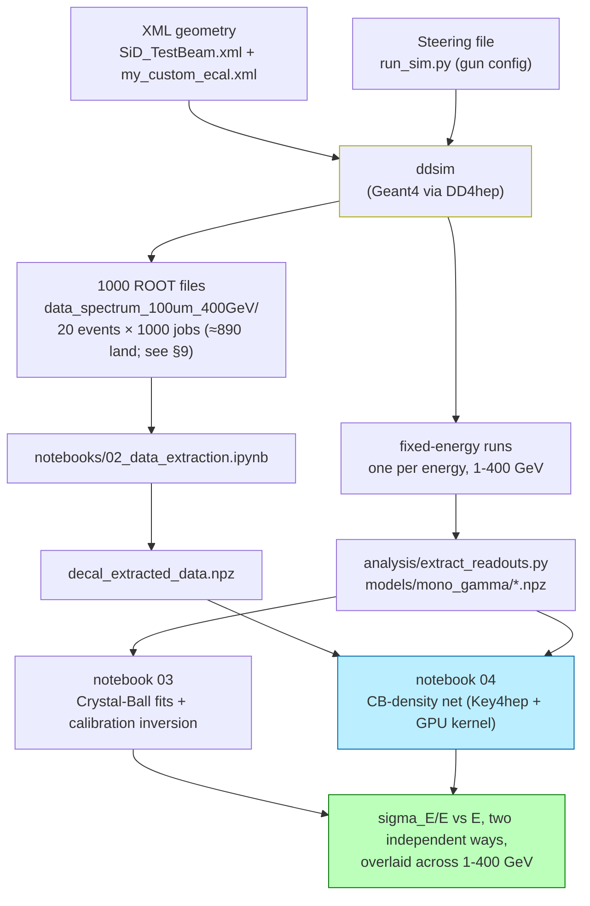

# CALOMAPS — Handbook

An operational and conceptual guide to the CALOMAPS DECAL R&D framework. This is the document you should be able to follow end-to-end to (a) understand what you're doing and why, and (b) actually run the pipeline and produce real physics output.

The companion document [DECAL_pipeline.md](DECAL_pipeline.md) is the canonical physics writeup. This handbook overlaps it deliberately but is pitched for collaborators who will read code, modify geometry, and run simulations. For environment-level quirks (SSHFS, JupyterHub flakes, CVMFS surprises) see [troubleshooting.md](troubleshooting.md).

---

## Table of contents

1. [Project at a glance](#1-project-at-a-glance)
2. [Why DECAL? — the physics motivation](#2-why-decal--the-physics-motivation)
3. [The detector geometry, in detail](#3-the-detector-geometry-in-detail)
4. [The particle gun](#4-the-particle-gun)
5. [Pipeline overview](#5-pipeline-overview)
6. [Setting up your environment](#6-setting-up-your-environment)
7. [Storage map — where files actually live](#7-storage-map--where-files-actually-live)
8. [Running a smoke-test simulation](#8-running-a-smoke-test-simulation)
9. [Running the production simulation](#9-running-the-production-simulation)
10. [Data extraction](#10-data-extraction)
11. [Training the ML resolution model](#11-training-the-ml-resolution-model-notebook-04)
12. [Energy reconstruction = calibration inversion](#12-energy-reconstruction--calibration-inversion)
13. [Interpreting the resolution results](#13-interpreting-the-resolution-results)
14. [Common gotchas (code-level)](#14-common-gotchas-code-level)
15. [Where to ask for help](#15-where-to-ask-for-help)

---

## 1. Project at a glance

CALOMAPS is a digital calorimeter (**DECAL**) R&D study. The pipeline:

1. Use a Geant4-based simulation (driven by DD4hep, configured by XML) to fire **photons of varying energies** into a custom electromagnetic calorimeter made of **silicon pixel layers** instead of analog pads.
2. From the raw hit data — restricted to the +y entry segment — compute four per-event readouts: **visible energy** (analog), **MIP count** (MIPs-per-pixel, `Σ max(1, round(E_pix/E_MIP))`), **raw hit count** (pixels above ½-MIP threshold, purely digital), and **cluster count** (number of 8-connected pixel clusters, summed over layers).
3. Measure the **energy resolution** σ_E/E of each readout two independent ways: the
   **conventional** test-beam method (fixed-energy runs + a Crystal-Ball fit per energy +
   calibration inversion, notebook 03) and an **ML density model** (a network that outputs the
   Crystal-Ball parameters as a smooth function of energy, trained on the spectrum,
   notebook 04) — and overlay them point-by-point across 1–400 GeV.
4. Separately, reduce the full shower cascade to **per-sensor charged-track crossings** —
   the impact point, direction and true momentum of every charged particle at every silicon
   layer (notebooks 05–07) — the input a detailed sensor-level simulation consumes.

A working end-to-end run produces all of it. The more interesting direction is to **change**
something in the geometry (pixel size, number of layers, tungsten thickness) and watch how the
resolution curves respond.

---

## 2. Why DECAL? — the physics motivation

Traditional electromagnetic calorimeters measure **analog energy**: each readout cell records how much energy was deposited in it, and the cell sizes are millimeters across. DECAL ("Digital Electromagnetic Calorimeter") proposes the opposite: each cell is **tens of micrometers**, and the readout is **binary** — either the cell was hit or it wasn't. Why throw away the energy information?

The bet is that across the relevant energy range, **binary hit-counting is sometimes a better measurement than analog energy** — for two unrelated physics reasons that happen to favor digital at *different ends* of the energy spectrum.

### 2.1 The low-energy advantage: Landau tail truncation

When a charged particle traverses a thin layer of silicon, the amount of energy it deposits is **not Gaussian** — it follows a **Landau distribution**: skewed, with a heavy high-energy tail caused by rare hard-scattering events (delta rays). At low shower energies, the absolute number of charged particles passing through the silicon is modest, and the Landau fluctuations on each one dominate the total visible energy.

```
Energy deposit per MIP-passage through 320 µm Si:

freq
  |     ▄
  |    ███
  |   █████
  |  ███████
  |  █████████ ▄
  | ███████████▄
  |█████████████▄▄
  |██████████████████▄▄▄
  |████████████████████████▄▄▄▄▄▄▄▄▄
  +─────────────────────────────────→ E [keV]
       ↑
       most probable          ↑ delta-ray tail
                              (rare, large)

  Analog readout: each hit is sampled from this entire shape.
  Variance across the whole distribution → bad resolution.

  Binary readout: each hit becomes a 1, regardless of where on
  the Landau distribution it landed. The tail is silently
  truncated. Resolution improves.
```

So at low energy (say, E < 20 GeV electrons or photons), **digital wins by ignoring the Landau tail**.

### 2.2 The high-energy catastrophe: pixel saturation

At high shower energies (E > 100 GeV), the electromagnetic shower at its core becomes extraordinarily dense — *dozens* of secondary particles cross the same small silicon volume. An analog readout sums their energy contributions correctly. A binary readout records the cell as "1" regardless of how many particles crossed it — it **saturates**.

```
Hits vs true energy:

hits
counted
  |                  digital saturation
  |                   _________
  |             ____/
  |          __/
  |       __/
  |     _/
  |   _/        ← linear at low/mid E
  |  /
  | /
  |/
  +─────────────────────────────────→ E_true

  Analog readout stays linear (sums correctly).
  Digital readout flattens — adding particles
  produces no new hits past saturation.
```

So at high energy (E > 100 GeV), **digital loses by saturating** while analog stays linear.

### 2.3 The story the resolution plots tell

```
                LOW E              MID E              HIGH E
              ────────           ────────           ─────────

Resolution     digital            both work          analog
(lower is      wins (Landau       roughly the        wins (no
better)        tail truncated)    same               saturation)

Linearity      both OK            both OK            digital
                                                     fails
                                                     (curve bends)
```

A central question for the project is: **at what pixel size does this trade-off look most attractive?** You can re-run the simulation at 25 µm, 50 µm, 100 µm, 200 µm pixels and watch the saturation knee move. That's a real publishable result.

The resolution is measured **twice, independently** — the conventional test-beam way
(fixed-energy beams + Crystal-Ball fits, notebook 03) and with an ML density model trained on
the continuous spectrum (notebook 04) — and the two are overlaid point-by-point across
1–400 GeV. Where they agree, both are validated; where either strains (discrete counts at
1–2 GeV, near-flat calibrations deep in saturation), that is physics worth understanding, not
a bug.

---

## 3. The detector geometry, in detail

### 3.1 The world

The simulation universe is a single 30 m × 30 m × 30 m air-filled box. **Almost everything from the SiD reference design is commented out:** no tracker, no HCal, no muon system, no beampipe, no solenoid (B = 0 everywhere). The only physical object inside is one custom ECal barrel.

This is intentional. We want a **clean test-beam-like environment** where every Geant4 event is "photon flies through air, hits silicon-tungsten stack, makes shower." No tracker upstream means no material budget, no scattering, no field-induced curvature — just the photon and the calorimeter.

The relevant file is [`geometry/SiD_TestBeam.xml`](../geometry/SiD_TestBeam.xml). Note the long block of `<!-- <include ref="baseline_sid_o2_v03/..."/> -->` comments — those are the SiD subdetectors that are *deliberately disabled*. Do not uncomment them unless you have a reason.

The baseline SiD XML files we inherited from are at [`geometry/baseline_sid_o2_v03/`](../geometry/baseline_sid_o2_v03/) — see [`PROVENANCE.md`](../geometry/baseline_sid_o2_v03/PROVENANCE.md) there for the full upstream attribution.

### 3.2 Coordinate system

DD4hep / Geant4 use a right-handed Cartesian system:

```
                +Z  (along the beamline)
                 │
                 │
                 │     +Y
                 │   ╱  (we shoot photons in this direction)
                 │ ╱
                 ●───────── +X
              origin
              (0, 0, 0)
              "the IP"
```

For CALOMAPS we don't really have a beamline — we just have a photon gun aimed at +Y, hitting one face of the dodecagonal barrel. The barrel is rotated 15° around z so its faces (not edges) point along the cardinal axes.

### 3.3 The DECAL barrel — top-down view

Look at the barrel from above (along the +z axis). It's a 12-sided polyhedron — a dodecagon — with inner radius 1264 mm and outer radius 1403 mm:

```
       ┌───────────┐         +Y  (gun direction)
       │           │            ▲
     ╱               ╲         photon
   ╱                   ╲         │
  │                     │        │
  │                     │        │
  │      hollow        rmax=1403 mm
  │      cavity         │        │
  │     (air,           │        │
  │      where the      │        │
  │      photon         │        │
  │      flies)         │        ▼  flight path:
  │                     │       (0,0,0) → (0, +∞, 0)
  │                     │
   ╲                   ╱        Photon enters
     ╲               ╱          the barrel face
       ╲   _____   ╱            whose normal is +Y
       │           │
       └───────────┘
       rmin=1264 mm
       (12 sides, rotated 15° about z)
```

The photon flies from origin radially outward along +Y, traverses ~1264 mm of air, and slams into the silicon-tungsten stack of the face whose outward normal is +Y. **All the showers in our dataset happen on the same face**, in the same spot, because we use a pencil beam with no smearing.

The barrel extends ±1765 mm along z (half-length 1765 mm).

### 3.4 The layer stack — radial cross-section

As the photon flies outward from r=1264 mm to r=1403 mm, it crosses **30 sampling layers**, each a tungsten + silicon + readout sandwich.

```
photon direction: → +radius

r=1264 mm
   │
   ▼  ┌──── ONE THIN LAYER (× 20 repeats) ──────────────┐
      │                                                  │
      │  ╔═══════╗  2.5 mm  TungstenDens24 (absorber)   │
      │  ║░░░░░░░║                                       │
      │  ╚═══════╝                                       │
      │  ░░░░░░░░░  0.25 mm air                          │
      │  ┃▓▓▓▓▓▓▓┃  0.32 mm SILICON ← sensitive!         │
      │  ─────────  0.05 mm copper (readout)             │
      │  ─────────  0.30 mm kapton                       │
      │  ░░░░░░░░░  0.33 mm air                          │
      │                                                  │
      └──────────────────────────────────────────────────┘
                  ↓ repeat 20 times

      ┌──── ONE THICK LAYER (× 10 repeats) ─────────────┐
      │                                                  │
      │  ╔═════════════╗  5.0 mm TungstenDens24          │
      │  ║░░░░░░░░░░░░░║  (twice the absorber)           │
      │  ╚═════════════╝                                 │
      │  ░░░░░░░░░       0.25 mm air                     │
      │  ┃▓▓▓▓▓▓▓┃       0.32 mm SILICON                 │
      │  ─────────       0.05 mm copper                  │
      │  ─────────       0.30 mm kapton                  │
      │  ░░░░░░░░░       0.33 mm air                     │
      │                                                  │
      └──────────────────────────────────────────────────┘
                  ↓ repeat 10 times

   ▲
   │
r=1403 mm
```

**Why thin-then-thick?** An EM shower is densest near its maximum, which lives in the early layers. There you want fine longitudinal sampling. Deep in the shower the tail is much sparser, so thicker absorber slices are fine.

**Why 320 µm silicon?** Standard MAPS thickness. Thin enough for well-defined Landau-distributed energy deposits per MIP-crossing; thick enough for reliable detection.

**Total radiation lengths:** 20 × 2.5 mm + 10 × 5.0 mm = 100 mm of absorber. The absorber is not pure tungsten but the SiD heavy alloy `TungstenDens24` (93% W / 6.1% Ni / 0.9% Fe by mass, ρ = 17.8 g/cm³ — see `geometry/baseline_sid_o2_v03/materials.xml`), whose X₀ ≈ 6.99 g/cm² ÷ 17.8 g/cm³ ≈ 3.93 mm → **~25 X₀**, plenty for EM containment.

### 3.5 Pixel segmentation

Each silicon layer is segmented into pixels of **100 µm × 100 µm** (`ECal_cell_size = 0.1*mm` in [`SiD_TestBeam.xml`](../geometry/SiD_TestBeam.xml)). Cartesian XY grid on the face of the silicon layer.

```
   +Z
    ▲
    │   ┌──┬──┬──┬──┬──┬──┬──┬──┬──┬──┬──┬──┬──┬──┐
    │   │  │  │  │  │  │  │  │  │  │  │  │  │  │  │
    │   ├──┼──┼──┼──┼──┼──┼──┼──┼──┼──┼──┼──┼──┼──┤
    │   │  │  │  │  │  │██│██│██│██│  │  │  │  │  │ ← lit pixels
    │   ├──┼──┼──┼──┼──┼██┼██┼██┼██┼──┼──┼──┼──┼──┤   from one
    │   │  │  │  │  │  │██│██│██│██│  │  │  │  │  │   shower
    │   ├──┼──┼──┼──┼──┼──┼──┼──┼──┼──┼──┼──┼──┼──┤
    │   │  │  │  │  │  │  │  │  │  │  │  │  │  │  │
    │   └──┴──┴──┴──┴──┴──┴──┴──┴──┴──┴──┴──┴──┴──┘
    │
    └────────────────────────────────────→ +X
```

Cell-coordinate bitfield: `system:5, side:-2, module:8, stave:4, layer:9, submodule:4, x:32:-16, y:-16`.

**Suggested experiment:** edit `ECal_cell_size` in [`SiD_TestBeam.xml`](../geometry/SiD_TestBeam.xml) and re-run. At what pitch does the high-energy saturation become intolerable? At what pitch does the low-energy Landau advantage disappear?

### 3.6 What a single 50 GeV photon shower actually looks like

Empirically (from a 10-event smoke run at fixed 50 GeV):

| Observable | Value | Comment |
|---|---|---|
| Geant4 wall time per event | ~0.9 s | Mostly EM shower simulation |
| Hits per event | ~6,000–8,500 (mean ≈ 7,700) | One "hit" = one pixel with non-zero energy |
| Total visible energy per shower | ~0.7 GeV out of 50 GeV true | **Sampling fraction ≈ 1.4%** (measured from data, not a fixed target — it depends on the Si/W thickness ratio; most energy is absorbed in the W) |
| Energy per hit | 3 neV — 5 MeV | Landau-shaped — most hits are MIP-like |
| Hit y-range | **[−1316, +1401] mm** | Spans both the +Y entry face *and* the −Y exit face |

**Why hits on the opposite face?** A 50 GeV EM shower is roughly 95% contained in the stack's ~25 X₀. The remaining ~5% (and many soft secondaries) escape *into* the air cavity inside the dodecagon, fly across, and strike the **opposite face**. So a single shower deposits hits on both the entry face and (less so) the exit face.

The extraction in `notebooks/02_data_extraction.ipynb` isolates the **entry segment** — the one dodecagon face the beam enters — keeping only hits in a ±15° wedge around +y within the silicon depth range:
```python
ang = np.degrees(np.arctan2(x, y))                    # angle from +y in the x-y plane
seg = (np.abs(ang) < 15) & (y > 1264 - 4) & (y < 1403 + 14)
```
The depth window cuts on `y`, not on `r = hypot(x, y)`: the +y facet is flat, so its silicon layers are planes of constant *y* (that same `y` is what indexes the layer).
This is deliberate: a real measurement reads out the module the beam enters, and isolating the segment excludes the cross-cavity leakage (an artifact of this closed test geometry, not of the calorimeter technology). To study leakage instead, widen the wedge or drop the angular cut.

### 3.7 Geometry summary (cheat sheet)

| Quantity | Value | Source |
|---|---|---|
| Inner radius | 1264 mm | `ECalBarrel_rmin` in `SiD_TestBeam.xml` |
| Outer radius | 1403 mm | `ECalBarrel_rmax` |
| Half-length z | 1765 mm | `ECalBarrel_half_length` |
| Symmetry | 12-fold (dodecagon) | `ECalBarrel_symmetry` |
| Thin layers | 20 × (2.5 mm W + 320 µm Si + readout) | `my_custom_ecal.xml` |
| Thick layers | 10 × (5.0 mm W + 320 µm Si + readout) | `my_custom_ecal.xml` |
| Total Si layers | **30** | |
| Total W-alloy absorber | 100 mm ≈ 25 X₀ (TungstenDens24, X₀ ≈ 3.93 mm) | |
| Pixel pitch | **100 µm × 100 µm** | `ECal_cell_size` |
| Magnetic field | **0 T** | `<fields>` in `SiD_TestBeam.xml` |

---

## 4. The particle gun

Configured in [`sim/run_sim.py`](../sim/run_sim.py).

| Parameter | Value | Notes |
|---|---|---|
| Particle | `gamma` (photon), default | Pure EM showers; override with `CALOMAPS_GUN_PARTICLE` (e.g. `pi+`, `pi-`, `proton`) — no file edits |
| Spectrum | uniform momentum, 5–400 GeV | Override with `CALOMAPS_GUN_PMIN_GEV` / `_PMAX_GEV`, or `_ENERGY_GEV` for a mono-energetic beam |
| Origin | (0, 0, 0) — the IP | Far from the calorimeter; photon flies through air first |
| θ (polar angle) | 90° (fixed) | Perpendicular to beam axis |
| φ (azimuthal angle) | 90° (fixed) | → direction vector is +Y |
| Physics list | `FTFP_BERT` | Standard high-energy physics list |

This is a **pencil beam**: every photon comes from origin going +Y. The only varying parameter between events is energy.

### 4.1 Why a pencil beam?

We want each event to be statistically identical modulo energy. That way the response curve isolates "digital calorimeter intrinsic response" from spatial-uniformity effects.

A more realistic study (a real collider experiment) would smear the gun. That's a good follow-up: train on the pencil beam, then re-simulate with smearing and see how the surrogate generalizes.

### 4.2 A note on the ddsim gun log (confusing but harmless)

```
Gun INFO Shoot [3] ... dir:( 0.000  0.000  1.000)       ← +Z??
Gun INFO Particle [0] gamma ... direction:( 0.000  1.000  0.000)    ← +Y ✓
```

The first line ("Shoot") is the gun's *intrinsic* axis before angles are applied; the second is the actual launched direction. Your photon goes +Y as configured.

### 4.3 Suggested experiments with the gun

- **Change particle type**: set `CALOMAPS_GUN_PARTICLE=pi+` (or `pi-`, `proton`) in front of `ddsim` or the generate scripts — no file edits. Hadronic showers are wider and longer. See notebook 00 §4 for the full gun-variable set (`CALOMAPS_GUN_PARTICLE` / `_PMIN_GEV` / `_PMAX_GEV` / `_ENERGY_GEV`).
- **Add angle smearing**: in `run_sim.py`, `phiMin = 85 deg, phiMax = 95 deg` gives a 10° fan of incident angles.
- **Move the gun**: shift `SIM.gun.position` to `(0, 0, 500*mm)` to study z-dependence.

---

## 5. Pipeline overview



Stage 1 (simulation) happens in a JupyterLab terminal (via `sim/generate_batched.sh` for the spectrum, `sim/generate_dataset.sh` per fixed energy). The rest happens in JupyterLab notebooks: extraction in notebook 02 (spectrum) and `analysis/extract_readouts.py` (per energy), the conventional resolution in notebook 03 (CPU kernel), and the ML resolution in notebook 04 on the `Key4hep + GPU` kernel.

A second product line — **per-sensor track crossings** for sensor-level simulation — branches
off after simulation (§10.1). The full notebook set, in pipeline order:

| Notebook | What it does |
|---|---|
| `00_simulate_your_samples` | generate your own datasets (terminal recipes) |
| `01_detector_and_data` (+ `01b` pion contrast) | the detector from first principles: X₀/λ_I budget, shower max vs ln E, Molière containment, the MIP scale, sampling fraction |
| `02_data_extraction` | canonical extraction → `decal_extracted_data*.npz` |
| `03_resolution_conventional` | fixed-energy Crystal-Ball fits + calibration inversion (§13) |
| `04_resolution_ml_crystalball` | ML CB-density net, overlaid on 03 across 1–400 GeV (§13) |
| `05_shower_4vectors` | full-cascade MCParticle 4-vectors |
| `06`/`07_sensor_crossings` | per-sensor track crossings — tracker / calorimeter routes (§10.1) |

(Converting the crossing records into input decks for PIXELAV — our collaborators' silicon
charge-transport simulation — lives on the `pixelav-inputs` branch; building and *running*
PIXELAV lives on `pixelav-integration`.)

---

## 6. Setting up your environment

### 6.1 Accounts

1. **FNAL computing account** + Kerberos principal `<username>@FNAL.GOV` (your group's Fermilab contact can set this up).
2. **EAF account** — automatic with your FNAL account. Log in at <https://eaf.fnal.gov>.

### 6.2 Spawn an EAF server

1. <https://eaf.fnal.gov> → Login
2. Spawner profile: **"GPU A100 20GB MIG"** (or the current GPU non-CMS profile).
3. Wait ~30s. You land in JupyterLab.

**Why this profile**: CALOMAPS needs `/nashome` (mounted) and a GPU. The CMS profile mounts `/uscms_data/` (not needed here) and uses a different image.

### 6.3 Get the code

```bash
# In a JupyterLab terminal:
cd /nashome/${USER:0:1}/$USER/
git clone https://github.com/murtaza-safdari/CALOMAPS.git
ln -s /nashome/${USER:0:1}/$USER/CALOMAPS/setup/setup_calomaps.sh ~/setup_calomaps.sh
```

The symlink lets you do `source ~/setup_calomaps.sh` from anywhere; the actual launcher lives in the repo.

#### The `~/lib_hack` OpenGL shim (now automatic)

DD4hep dynamically loads `libOpenGL.so.0` at startup. AlmaLinux 9 on EAF ships the same OpenGL implementation under the SONAME `libGL.so.1` (at `/usr/lib64/libGL.so.1`), but not under the `libOpenGL.so.0` name DD4hep wants. Since you don't have `sudo` to install system libraries, the fix is a single user-writable symlink that aliases the missing name to the present one.

**You no longer do this by hand.** `setup_calomaps.sh` (next step) creates `~/lib_hack/libOpenGL.so.0 → /usr/lib64/libGL.so.1` automatically the first time you source it, and prepends `~/lib_hack` to `LD_LIBRARY_PATH`. When DD4hep's `dlopen` looks for `libOpenGL.so.0`, the loader finds the symlink and resolves it to AlmaLinux's `libGL.so.1`. Without the shim, `ddsim` crashes at startup with `error while loading shared libraries: libOpenGL.so.0: cannot open shared object file`.

If the auto-create ever fails (e.g. `libGL.so.1` lives somewhere unusual), the script prints a warning and you can fall back to the manual symlink:

```bash
mkdir -p ~/lib_hack
ln -s /usr/lib64/libGL.so.1 ~/lib_hack/libOpenGL.so.0
```

See [troubleshooting.md](troubleshooting.md) for the why behind user-space library injection on shared HPC nodes.

### 6.4 Source the environment

```bash
source ~/setup_calomaps.sh
```

What this does (see [`setup/setup_calomaps.sh`](../setup/setup_calomaps.sh)):

1. `source /cvmfs/sw.hsf.org/key4hep/setup.sh -r 2026-02-01` — loads Key4hep (Geant4, ROOT, DD4hep, uproot, NumPy, PyTorch CPU). ~30 GB from CVMFS.
2. Creates `~/lib_hack/libOpenGL.so.0` if missing, then prepends `~/lib_hack` to `LD_LIBRARY_PATH` — the OpenGL workaround for DD4hep (see above).
3. Registers the **Key4hep (CPU)** Jupyter kernel (`calomaps_cpu`) — a wrapper kernel whose launcher sources Key4hep before starting, so GUI-launched notebooks see `uproot`/`numpy`/`awkward`. This is the kernel the CPU notebooks are saved with.
4. `chmod +x $CALOMAPS_HOME/sim/*.sh` — restores the executable bit, which a fresh `git clone` onto the SSHFS mount drops.
5. `export CALOMAPS_HOME=<repo root>` — self-located from the script's own path (through the `~/setup_calomaps.sh` symlink), so it works wherever you cloned. Override by exporting `CALOMAPS_HOME` before sourcing.
6. `export CALOMAPS_DATA_BASE=$HOME/CALOMAPS-data` (and `mkdir -p` it) — where simulation data lives.
7. `cd $CALOMAPS_HOME/sim` — drops you in the work dir.

The script only *warns* (never `exit`s) on a missing piece, so sourcing it can't kill your shell. Source once per terminal. Notebooks don't need it — the JupyterLab kernel inherits CVMFS at spawn.

#### Notebook kernels

- **CPU notebooks** (00, 01/01b, 02, 03, 05, 06, 07) are saved against the **`Key4hep (CPU)`** kernel (`calomaps_cpu`), which `source ~/setup_calomaps.sh` registers automatically (step 3 above). A GUI-launched kernel never inherits a terminal's environment, so this wrapper kernel — whose launcher sources Key4hep itself — is what makes the notebooks work for a fresh clone. Reload JupyterLab after first sourcing to see it.
- **The GPU notebook** (04) needs the **`Key4hep + GPU`** kernel (`calomaps_gpu`) from `bash $CALOMAPS_HOME/setup/setup_gpu_kernel.sh` (§11.2).

### 6.5 Editing files

- **JupyterLab browser**: open files directly. Simple but slow for greps.
- **Laptop SSHFS**: mount `/nashome/` and use VS Code or any local editor. Faster, but be aware of the SSHFS small-write bug — see [troubleshooting.md](troubleshooting.md).

```bash
# Mac with FUSE-T / macFUSE:
mkdir -p ~/nashome
sshfs <username>@cmslpc-el9.fnal.gov:/nashome ~/nashome -o reconnect,defer_permissions
```

The 21 GB simulation data is not visible via the mount (it lives in `/home/<username>/` on EAF, container-local).

---

## 7. Storage map — where files actually live

```
┌──────────────────────────────┐    ┌──────────────────────────────┐
│  Your laptop                  │    │  EAF JupyterLab container     │
│                               │    │                               │
│  ~/nashome/m/<u>/CALOMAPS/    │◄──►│  /nashome/m/<u>/CALOMAPS/     │
│  ├── geometry/                │SSHFS  ├── geometry/                │
│  ├── sim/                     │    │  ├── sim/                     │
│  ├── analysis/                │    │  ├── analysis/                │
│  ├── notebooks/               │    │  ├── notebooks/               │
│  ├── docs/                    │    │  ├── docs/                    │
│  └── setup/                   │    │  └── setup/                   │
│                               │    │                               │
│       (~4 MB source tree)     │    │   /home/<u>/                  │
│                               │    │   ├── CALOMAPS-data/  ← 21 GB │
│       not laptop-visible:     │    │   ├── lib_hack/                │
│                               │    │   ├── calomaps_gpu_env/              │
│                               │    │   └── setup_calomaps.sh        │
│                               │    │      (symlink → repo)          │
│       /cvmfs/...              │    │   /cvmfs/sw.hsf.org/key4hep/  │
│                               │    │       (~30 GB CVMFS)          │
└──────────────────────────────┘    └──────────────────────────────┘
```

**Key principle**: source tree on `/nashome` is small and laptop-visible; data lives on `/home/<u>` (EAF only). The two are connected by `$CALOMAPS_DATA_BASE`.

---

## 8. Running a smoke-test simulation

Goal: confirm in ~30 seconds that your environment works end-to-end.

In a JupyterLab terminal (after sourcing `setup_calomaps.sh`):

```bash
CALOMAPS_GUN_ENERGY_GEV=50 ddsim \
  --compactFile $CALOMAPS_HOME/geometry/SiD_TestBeam.xml \
  --steeringFile $CALOMAPS_HOME/sim/run_sim.py \
  -N 10 \
  --random.seed 42 \
  --outputFile /tmp/smoke_test_50GeV.root
```

(`CALOMAPS_GUN_ENERGY_GEV=50` gives a clean mono-energetic 50 GeV beam — the project's own gun mechanism, §4 — instead of the default 5–400 GeV spectrum.)

Inspect the output:

```python
import uproot, numpy as np
with uproot.open("/tmp/smoke_test_50GeV.root") as f:
    tree = f["events"]
    print(f"events: {tree.num_entries}")               # → 10
    print(f"branches: {len(tree.keys())}")             # → 68
    x = tree["ECalBarrelHits/ECalBarrelHits.position.x"].array()
    e = tree["ECalBarrelHits/ECalBarrelHits.energy"].array()
    print(f"hits/event: {[len(xa) for xa in x]}")
    # at 50 GeV with 100 µm pixels: expect ~6,000-8,500 hits/event
    all_e = np.concatenate([ea.to_numpy() for ea in e])
    print(f"total visible E (all events): {all_e.sum():.2f} GeV")
    # expect ~7 GeV (10 events × ~0.7 GeV each ≈ 1.4% sampling fraction for this geometry)
```

**Expected smoke-test pass criteria:**

| Check | Expected |
|---|---|
| `events.num_entries` | 10 |
| Number of branches | 68 |
| ECalBarrel-related branches | 22 |
| Hits per event | 6,000 – 8,500 (mean ~7,700) |
| Hit y-range | spans both [+1264, +1403] and [−1403, −1264] |
| Total visible E across 10 events | ~7–8 GeV |
| Geant4 wall time | <30 s for 10 events |

If all within 20% of expected, your environment is healthy.

---

## 9. Running the production simulation

The real datasets come from [`sim/generate_batched.sh`](../sim/generate_batched.sh):

```bash
source ~/setup_calomaps.sh
bash $CALOMAPS_HOME/sim/generate_batched.sh
```

Defaults: 1000 jobs × 20 events each = **20,000 events** nominal, uniform momentum 5–400 GeV, written to `$CALOMAPS_DATA_BASE/data_spectrum_100um_400GeV/sim_photons_part*.root`. Runs in batches of 20 parallel jobs. Individual jobs occasionally die under load, so a ~90% file yield is normal (the shipped run has 889 files / 17,780 events); the extraction simply uses the files present.

**Rough timing**: ~30 minutes to 2 hours wall time depending on EAF load.

⚠️ **Before running**: before generating anything, the script deletes the previous run's files (`rm -f $OUT_DIR/sim_<particle>_part*.root`, e.g. `sim_photons_part*` for gamma) — it replaces the existing dataset for that particle. If you want to keep the current 21 GB, change `DATASET_NAME` or comment out the rm. Use `nohup ... &` or `tmux` so a flaky browser doesn't kill the run.

For energy-range studies, [`sim/generate_dataset.sh`](../sim/generate_dataset.sh) is a simpler 200×100 variant.

**Other particles**: prefix either script with `CALOMAPS_GUN_PARTICLE` and it writes its own dataset directory — no file edits, and the photon default is untouched:

```bash
CALOMAPS_GUN_PARTICLE=pi+ bash $CALOMAPS_HOME/sim/generate_batched.sh
# -> $CALOMAPS_DATA_BASE/data_spectrum_100um_400GeV_piplus/sim_piplus_part*.root
```

Both scripts resolve the geometry + steering by absolute path, so they run correctly from any directory.

---

## 10. Data extraction

Open [`notebooks/02_data_extraction.ipynb`](../notebooks/02_data_extraction.ipynb) with the **`Key4hep (CPU)`** kernel (extraction is I/O-bound). The cells:

1. Loop over all `sim_photons_part*.root` files in `$CALOMAPS_DATA_BASE/data_spectrum_100um_400GeV/`.
2. Per event, compute:
   - `E_true` — true photon energy `√(p²+m²)` from the truth-level MC particle
   - `E_vis` — sum of all hit energies in the entry segment (analog readout)
   - `MIP count` — sum over fired pixels of `max(1, round(E_pix / E_MIP))` (MIPs-per-pixel; every fired pixel counts as ≥1 MIP)
   - `hit count` — number of pixels above the ½-MIP threshold (strict digital)
   - `cluster count` — number of 8-connected pixel clusters, summed over layers
3. Save into `models/decal_extracted_data.npz`.

The notebook parallelizes with `ProcessPoolExecutor(max_workers=min(32, os.cpu_count() or 8))`. Lower the cap if memory-pressed.

### 10.1 Cascade + per-crossing-momentum extraction (shower 4-vectors + sensor crossings)

The per-sensor crossing product (notebooks 05–07) needs the full shower cascade and, per
charged-track sensor crossing, the impact point, direction and **momentum**. Two single-event `ddsim`
runs of the same 50 GeV photon (both pin seed 424242 → identical shower), steered from `sim/`, produce it:

| Run | Steering | Si readout | Gives |
|-----|----------|-----------|-------|
| Calorimeter cascade | `run_sim_fullcascade.py` | calorimeter (detailed mode) | MCParticle cascade + per-step `CaloHitContribution` (position, PDG, time) |
| Tracker momentum | `run_sim_trackermom.py` | **tracker** (`Geant4TrackerWeightedAction`) | one `SimTrackerHit` per crossing **with momentum** |

EDM4hep's `CaloHitContribution` carries no momentum, so `run_sim_trackermom.py` reads the ECal Si
out as a Geant4 tracker via one line — `SIM.action.mapActions['ECalBarrel'] = 'Geant4TrackerWeightedAction'`
— and the resulting `SimTrackerHit`s carry the true Geant4 momentum at each crossing.

**Minimal diff vs the baseline `run_sim.py`.** The raw file diff is ~100 lines, but only these
five lines are load-bearing (the rest just reproduces the canonical gun or is optional env/output):

| Line | Run | What it does |
|------|-----|--------------|
| `SIM.random.seed = 424242` | both | pins the shower, so the calo and tracker runs read out the *same* event |
| `SIM.part.userParticleHandler = ""` | both | removes the tracking-region cut so ECal secondaries (born r > 1267 mm) persist |
| `SIM.part.keepAllParticles = True` | both | writes every Geant4 track as an `MCParticle` (no KE pruning) |
| `SIM.enableDetailedShowerMode = True` | calo | fills each `CaloHitContribution` with per-step `stepPosition`/`PDG` (zero in SIMPLE mode) |
| `SIM.action.mapActions['ECalBarrel'] = 'Geant4TrackerWeightedAction'` | tracker | reads the ECal Si as a tracker → one `SimTrackerHit` per crossing **with momentum** |

The first three are truth-persistency — they change *which* truth is written, not the physics
(notebook 05 §2 shows the deposit distribution is unchanged); the last two switch on the
per-crossing readouts the crossing records need.

Run the chain from an EAF terminal (`ddsim` needs `lib_hack` on `LD_LIBRARY_PATH`, §6.3):

```bash
source ~/setup_calomaps.sh                       # Key4hep + lib_hack + CALOMAPS_* env
export CALOMAPS_DATA_BASE=/tmp/calomaps-data     # off-quota; /home has a 23 GB per-user cap
cd $CALOMAPS_HOME/geometry
ddsim --compactFile SiD_TestBeam.xml --steeringFile ../sim/run_sim_fullcascade.py --numberOfEvents 1
ddsim --compactFile SiD_TestBeam.xml --steeringFile ../sim/run_sim_trackermom.py  --numberOfEvents 1
python ../analysis/extract_cascade.py            # -> models/fullcascade_*.npz  (cascade + step truth)
python ../analysis/extract_trackermom.py         # -> models/trackermom_*.npz   (per-crossing momentum)
python ../analysis/sensor_crossings.py           # -> models/sensor_crossings_* (auto-picks variant C)
```

⚠️ **Key4hep release**: both runs keep the full ~78k-particle cascade. On the older EAF image the
pinned `2026-02-01` release crashed (`free(): invalid pointer`) while *finalizing* such a large
EDM4hep file; on the current AlmaLinux 9 images with the pinned release the crash has not been
observed. If you do hit it, source the `2026-04-08` release for these
two runs — see `troubleshooting.md`, "EDM4hep podio writer crashes on very large events".

`sensor_crossings.py` auto-selects **variant C** (tracker hits → real per-crossing `|p|`,
direction and impact) when the trackermom `.npz` is present, else falls back to variant A (calo
step truth, production momentum). Notebooks
[`05_shower_4vectors`](../notebooks/05_shower_4vectors.ipynb),
[`06_sensor_crossings_tracker`](../notebooks/06_sensor_crossings_tracker.ipynb) (§5 validates
the per-crossing momentum) and
[`07_sensor_crossings_calo`](../notebooks/07_sensor_crossings_calo.ipynb) inspect these
outputs. Main deliberately stops at the validated crossing records: converting them into input
decks for **PIXELAV** (our collaborators' silicon charge-transport simulation) lives on the
`pixelav-inputs` branch, and building/running PIXELAV itself on the `pixelav-integration`
branch.

Notebook 05 §2 also contrasts the stock vs full-cascade config over 20 events each to show the
persistency settings don't change the physics; it reads `models/config_ab_gamma50.npz`, which
[`analysis/make_config_ab.py`](../analysis/make_config_ab.py) regenerates (the panel is skipped
gracefully if the file is absent). The cross-readout consistency checks (byte-identical cascade,
crossings-per-layer agreement, the silicon-MIP dE/dx) are in notebook 06 §8.

### 10.2 Controlling which secondaries are produced and saved

Both SD steering files keep the **entire** Geant4 cascade by default (every track written as an
MCParticle). Two independent knobs change that, and they act at **different stages** — conflating
them is a classic source of confusion, so they are kept separate here. Both are exposed as
environment variables on `run_sim_fullcascade.py` and `run_sim_trackermom.py`; the defaults
reproduce the canonical run, so existing outputs are unchanged.

| Knob | Env var | DDSim attribute | Default | Acts at | Changes physics? |
|------|---------|-----------------|---------|---------|------------------|
| Production range cut | `CALOMAPS_RANGECUT_MM` | `SIM.physics.rangecut` | 0.7 mm | secondary **production** | **Yes** |
| Persistency floor | `CALOMAPS_MIN_KE_MEV` (+ `CALOMAPS_KEEP_ALL=0`) | `SIM.part.minimalKineticEnergy` / `keepAllParticles` | 1 MeV / keep-all | output **writing** | No |

**Production range cut (physics).** `SIM.physics.rangecut` is the Geant4 secondary-production
threshold, given as a range (converted per material to an energy). Below it, soft delta-rays and
low-energy photons are **not created as separate tracks** — their energy is deposited continuously
along the parent's step. It is a genuine physics/CPU knob: lowering it produces more soft
secondaries (→ more charged-track sensor crossings) at higher CPU cost; raising it
coarsens the shower and the deposited-energy pattern. DDSim's default is 0.7 mm.

```bash
# finer delta-ray production (more, softer sensor crossings), same output format:
CALOMAPS_RANGECUT_MM=0.05 ddsim --compactFile SiD_TestBeam.xml \
    --steeringFile ../sim/run_sim_trackermom.py --numberOfEvents 1
```

**Persistency floor (output only).** `SIM.part.minimalKineticEnergy` decides which
**already-simulated** particles get written to the MCParticle truth collection — it does **not**
change the physics or the energy deposited, only the size/content of the truth output. The catch:
this floor is **ignored while `keepAllParticles` is `True`** (the default), so raising
`CALOMAPS_MIN_KE_MEV` alone does nothing. You must also set `CALOMAPS_KEEP_ALL=0`:

```bash
# prune most sub-10-MeV truth particles (physics unchanged, smaller truth collection):
CALOMAPS_KEEP_ALL=0 CALOMAPS_MIN_KE_MEV=10 ddsim --compactFile SiD_TestBeam.xml \
    --steeringFile ../sim/run_sim_fullcascade.py --numberOfEvents 1
```

Even then the floor is **not a pure kinematic cut**: DD4hep keeps any particle that left a detector
hit (and all primaries/parents), combining only the sub-threshold, hit-less tracks into their
parents. So on the tracker-readout `run_sim_trackermom.py` run — where *every* Si crossing makes a
`SimTrackerHit` — the sub-10-MeV crossing tracks **survive** the floor; to thin soft sensor
crossings there, use the range cut, not the persistency floor.

**Which one do you want?** For **per-crossing records**, the physically meaningful knob is
almost always the **production cut** — it controls how many soft charged tracks actually exist to
cross a sensor. The persistency floor only prunes the *saved* truth; and for ECal secondaries its
upstream semantics are entangled with `userParticleHandler`, which both SD files clear to `""` so
that out-of-tracking-region ECal secondaries (born at r > 1267 mm) persist at all. Use the
persistency floor when you want a smaller truth file without touching the physics; use the range
cut when you want to change what the shower actually produces. To change the **gun energy**, set
`CALOMAPS_GUN_ENERGY_GEV` (the same variable name the baseline `run_sim.py` uses).

---

## 11. Training the ML resolution model (notebook 04)

Notebook [`04_resolution_ml_crystalball.ipynb`](../notebooks/04_resolution_ml_crystalball.ipynb)
trains the Crystal-Ball density ensembles in [`analysis/cbnet.py`](../analysis/cbnet.py):

- **Model**: a small MLP mapping normalized true energy to the four Crystal-Ball parameters
  (μ, σ, α, n) of the fractional response `readout / E_true` at that energy.
- **Loss**: unbinned negative log-likelihood of the Crystal Ball on the raw per-event readouts.
- **Ensemble**: 20 networks per readout, each with its own 80/20 train/val split; the predicted
  CB parameters are averaged.
- **Training set**: the 5–400 GeV spectrum extraction plus the 1 and 2 GeV fixed-energy runs
  (low-energy anchors), so the learned curves cover the full 1–400 GeV of notebook 03's scan.

**Total work**: 4 readouts × 20 models — about 20 minutes on the standard A100 MIG slice (a few minutes on a full A100); ~an hour on CPU.

*(The repository also carries a legacy quantile-regression surrogate — `analysis/quantilenet.py`
with the `train_ensembles.py` / `verify_ensembles.py` CLIs and `analysis/dashboard.py` — from an
earlier iteration of the resolution analysis. The notebooks no longer use it; the files remain
for reference.)*

### 11.1 Reusing pre-trained models

Notebook 04 writes its ensembles to `models/saved_cbnet_gpu_<tag>/` (4 small `.pth` bundles).
These are **not committed to git** (`.gitignore` excludes `models/`). Set `CB_RETRAIN=0` in the
environment to reuse existing ensembles instead of retraining; `CB_NMODELS` / `CB_EPOCHS` size a
quick smoke run.

**CPU-loading caveat**: GPU-trained ensembles serialize CUDA tensors. To load on a CPU kernel,
`torch.load(...)` needs `map_location=device`; `cbnet.load_ensemble` handles this.

### 11.2 Training new models on the GPU

The CVMFS Key4hep `2026-02-01` release ships a **CPU-only** PyTorch (`torch.backends.cuda.is_built() → False`). You need to install a CUDA-enabled torch into a venv first.

**Recommended path (one command)**: from a JupyterLab terminal (after `source ~/setup_calomaps.sh`) run `bash $CALOMAPS_HOME/setup/setup_gpu_kernel.sh`. It builds a self-contained CUDA-torch venv and registers the **Key4hep + GPU** kernel in one step, then asserts `torch.cuda.is_available()` so a failed install is obvious. The venv defaults to `/tmp` (wiped on container restart — just re-run); set `CALOMAPS_GPU_ENV=$HOME/calomaps_gpu_env` for a persistent install if home has ~5 GB free. Then open notebook 04 and pick the **Key4hep + GPU** kernel.

The script's canonical names are venv `calomaps_gpu_env` and kernel dir `calomaps_gpu` (display name **Key4hep + GPU**). The two manual paths below explain what it automates — use them only to do it by hand or to debug; note they use *different* example names (`my_gpu_env`, `cu_torch_env`), so don't mix a hand-built install with the script's.

#### Path A — manual UI walkthrough (what the script automates)

##### One-time per account: create `~/my_gpu_env` and register the kernel

The `Key4hep + GPU` kernel in JupyterLab is backed by a Python venv at `~/my_gpu_env/` whose `kernel.json` lives in `~/.local/share/jupyter/kernels/my_gpu_env/`. **A fresh EAF account doesn't have either.** Skip this block if the `Key4hep + GPU` kernel already appears in the JupyterLab kernel selector.

```bash
# In a JupyterLab terminal:
source ~/setup_calomaps.sh   # need the CVMFS python on PATH

# Create the venv. --system-site-packages lets it inherit the entire Key4hep
# stack (uproot, numpy, matplotlib, ...) so we only need to install the one
# package we want to override (torch) rather than reinstalling everything.
python -m venv --system-site-packages ~/my_gpu_env

# Register the kernel with JupyterHub. After this, "Key4hep + GPU" appears
# in the kernel selector and points at ~/my_gpu_env/bin/python.
~/my_gpu_env/bin/python -m ipykernel install \
    --user --name=my_gpu_env --display-name="Key4hep + GPU"
```

**Note**: at this point the venv exists and the kernel is registered, but the venv's `site-packages/` is empty. When you `import torch` from this kernel, you'll get CVMFS's **CPU-only** torch (inherited via `--system-site-packages`). The next step installs GPU torch *into* the venv so it shadows CVMFS — that's the actual fix.

##### Install GPU torch into the kernel

1. Open [`notebooks/04_resolution_ml_crystalball.ipynb`](../notebooks/04_resolution_ml_crystalball.ipynb) in JupyterLab.
2. Switch kernel to **`Key4hep + GPU`**.
3. In a cell:
   ```python
   !pip install --force-reinstall torch torchvision torchaudio \
       --index-url https://download.pytorch.org/whl/cu121
   ```
4. **Restart the kernel.** (Kernel menu → Restart Kernel.)
5. Verify:
   ```python
   import torch
   print(torch.__version__)             # expect 2.x.x+cu121
   print(torch.cuda.is_available())     # expect True
   print(torch.cuda.get_device_name(0)) # expect "NVIDIA A100 ..."
   ```
6. Run the notebook top to bottom (training is on by default; `CB_RETRAIN=0` skips it).

Why this works: the JupyterLab launcher invokes `~/my_gpu_env/bin/python` directly without sourcing CVMFS, so your venv-installed cu121 torch wins on `sys.path`.

#### Path B — Terminal / script (fallback)

From a CVMFS-sourced terminal, `sys.path` already has CVMFS torch ahead of any venv. Workarounds:

- **Use the `sys.path` shim** (see [§11.3](#113-why-the-syspath-hack-path-b-only)); the legacy
  [`analysis/train_ensembles.py`](../analysis/train_ensembles.py) CLI has it baked in.
- **Install to `/tmp/cu_torch_env/`** instead of `~/my_gpu_env/` if `/home/<u>` is full (the 4.4 GB install often doesn't fit in EAF's 23 GB home quota).

Full recipe:

```bash
source ~/setup_calomaps.sh

/cvmfs/sw.hsf.org/key4hep/releases/2026-02-01/x86_64-almalinux9-gcc14.2.0-opt/python/3.13.8-z2dydk/bin/python3.13 \
    -m venv --system-site-packages /tmp/cu_torch_env

/tmp/cu_torch_env/bin/pip install --force-reinstall torch \
    --index-url https://download.pytorch.org/whl/cu121

# Smoke-test
/tmp/cu_torch_env/bin/python -c "
import sys
sys.path = [p for p in sys.path if 'py-torch' not in p]
sys.path.insert(0, '/tmp/cu_torch_env/lib/python3.13/site-packages')
import torch
print('cuda available:', torch.cuda.is_available())
print('device:', torch.cuda.get_device_name(0))"

# Then register this venv as a Jupyter kernel (as in Path A) and run notebook 04 with it.
```

`/tmp` on EAF is overlay, several TB free, but **wiped on container restart** — re-do the install each fresh session.

### 11.3 Why the `sys.path` hack (Path B only)

When `setup_calomaps.sh` is sourced, CVMFS pre-pends ~30 `/cvmfs/.../site-packages/` paths to `PYTHONPATH`, including the CPU-only CVMFS torch. Even from inside a venv, `import torch` finds CVMFS first because it's earlier in `sys.path`.

```python
import sys
sys.path = [p for p in sys.path if 'py-torch' not in p]    # drop CVMFS torch
sys.path.insert(0, '/tmp/cu_torch_env/lib/python3.13/site-packages')  # venv first
import torch    # now the cu121 build wins
```

Only needed in **Path B**. In Path A (JupyterLab UI), the kernel spawns without CVMFS pre-sourced, so the venv's own torch wins naturally — no shim required.

---

## 12. Energy reconstruction = calibration inversion

Both resolution notebooks reconstruct energy the same way: build a monotonic forward response
model μ(E) — **measured** point-by-point from the fixed-energy fits in notebook 03, **learned**
from the spectrum in notebook 04 — then invert it: `E_reco = μ⁻¹(readout)`. The width of the
response, pushed through the same inverse, becomes the energy resolution. Where a digital
readout saturates, μ(E) flattens and a small readout width maps onto a huge energy interval —
quoting the raw σ/μ of the counts would hide exactly that, which is why the inversion is not
optional (notebook 03 §7 demonstrates it graphically).

The shared implementation is `build_calibration()` in
[`analysis/decal_cbfit.py`](../analysis/decal_cbfit.py): a monotonic PCHIP interpolation of
μ(E) with a log-log linear extension beyond the fitted range, so an up-fluctuation inverts
instead of being silently clamped. Points a saturated readout genuinely cannot reach are
reported as `NaN` and dropped rather than clipped — clipping would fabricate a resolution
turnover at the edge of the grid.

(The legacy quantile pipeline in [`analysis/dashboard.py`](../analysis/dashboard.py) performs
the same inversion per event with Brent root-finding; the notebooks no longer use it.)

---

## 13. Interpreting the resolution results

The headline plots are **notebook 03 §8** and **notebook 04 §8**: σ_E/E against 1/√E, where a
purely stochastic resolution is a straight line through the origin. Both fit the standard
calorimeter parameterization

$$\frac{\sigma_E}{E} = \frac{a}{\sqrt{E}} \oplus b \oplus \frac{c}{E}$$

(⊕ = quadrature; *a* = stochastic, *b* = constant, *c* = electronic noise — this simulation has
no electronics noise, so the two-term `a/√E ⊕ b` form is fitted).

### 13.1 What it actually looks like (100 µm pixels, photons, 1–400 GeV)

- **True Analog** is the benchmark: a near-straight line with a stochastic term of roughly
  17%·√GeV and a small constant term (~4%) — stochastic-dominated at low energy (the exact
  fitted numbers print in notebook 03 §8 / notebook 04 §8).
- **MIP counting** tracks analog closely — at 100 µm pitch each MIP crossing reliably fires
  one pixel.
- **Raw Hits** actually has the *smallest* stochastic term (~16–17%·√GeV — Landau-tail
  truncation helps the fine binary readout at low E) and a constant term comparable to
  analog, so at 100 µm pitch its Gaussian **core** tracks or slightly beats analog across the
  whole range: pixel saturation is mild at this fine pitch. The high-E digital penalty shows
  up instead in the **tail-inclusive effective width** (notebook 04 §7) and, most clearly, in
  the naive clustering below.
- **Naive 2D Clustering** is the one readout with a clearly inflated constant term (~5%) and
  the worst high-E resolution — the cluster *count* stops growing as the dense core merges
  adjacent pixels into a few blobs.
- The **conventional (03) and ML (04) measurements agree point-by-point across 1–400 GeV** on
  the core width (a small ~0.5% constant-term offset is the binned-χ² vs unbinned-ML
  fit-method difference, quantified in 04 §8). Notebook 04 additionally separates the
  tail-inclusive **effective** width from the Gaussian **core** — the gap between the two is
  the growing low-side leakage tail.

The DECAL physics is visible in two places: the Landau-truncation advantage that gives the
digital readouts a *smaller* stochastic term at low E, and the saturation penalty at high E —
mild for raw hits at this fine pitch, pronounced for the clustering and for the tail-inclusive
width.

**Suggested experiment**: a pixel-pitch scan (25 / 50 / 100 / 200 µm). The "saturation knee vs
pitch" curve is a real publishable result.

### 13.2 Other diagnostic plots in the notebooks

- **First-principles budgets** (notebook 01): X₀/λ_I stack budget, shower max vs ln E,
  Molière containment, the per-pixel MIP spectrum.
- **Longitudinal shower profiles** by truth energy (notebook 02 §7).
- **Fit-quality overlays** at fixed energies (03 §5, 04 §5) — never quote a σ you haven't
  looked at.
- **Calibration / linearity curves**, measured (03 §6) and learned (04 §9) — flattening is
  saturation.

### 13.3 Generating the fixed-energy datasets

Notebook 03 (and notebook 04's anchors + overlay points) need one dataset **per energy**, each
with a **distinct `CALOMAPS_DATASET_NAME`** — the generate scripts wipe their output dir on
start (see §14 "Pre-existing generate scripts wipe the data dir"), so two fixed-energy runs
into the same dir would clobber each other. The raw ROOT is large, so keep it on a roomy
scratch area and extract to the small per-energy `.npz`, deleting the ROOT as you go (EAF
`/home` is a tight ~23 GB):


```bash
for E in 1 2 5 10 20 50 100 200 400; do
  CALOMAPS_GUN_PARTICLE=gamma CALOMAPS_GUN_ENERGY_GEV=$E \
  CALOMAPS_DATASET_NAME=mono_gamma_${E}GeV \
  CALOMAPS_DATA_BASE=/scratch/$USER/CALOMAPS-mono \
  bash sim/generate_dataset.sh
  # >>> extract the four readouts into one .npz per energy <<<
  #   python analysis/extract_readouts.py --datadir .../mono_gamma_${E}GeV \
  #             --energy $E --out $CALOMAPS_HOME/models/mono_gamma/decal_mono_gamma_E$(printf '%04d' $E)GeV.npz
  #   (or reuse your notebook-02 readout code on each dataset)
  rm -rf /scratch/$USER/CALOMAPS-mono/mono_gamma_${E}GeV   # free scratch as you go
done
```

## 14. Common gotchas (code-level)

This section covers **code-level errors**. For **infrastructure-level quirks** (SSHFS, JupyterHub flakes, CVMFS surprises, disk quotas), see [troubleshooting.md](troubleshooting.md).

### `Torch not compiled with CUDA enabled`
CVMFS Key4hep 2026-02-01 torch is a CPU-only build (`torch.backends.cuda.is_built() → False`). Even on a GPU node, this torch can't use it.

**Fix**: install CUDA-enabled torch into your venv. See [§11.2 Path A](#112-training-new-models-on-the-gpu).

### Loading saved ensembles fails with `Attempting to deserialize object on a CUDA device but torch.cuda.is_available() is False`
GPU-trained ensembles use CUDA tensors. The repo's `load_ensemble` functions
([`analysis/cbnet.py`](../analysis/cbnet.py), and the legacy
[`analysis/quantilenet.py`](../analysis/quantilenet.py)) pass `map_location=device` to
`torch.load(...)` to handle this. If you write your own loader, remember the `map_location`
argument.

### Notebook can't find the data files
You're using an old relative path like `"data_spectrum_100um_400GeV/sim_photons_part1.root"`. All current code uses `$CALOMAPS_DATA_BASE`:

```python
import os
data_base = os.environ.get("CALOMAPS_DATA_BASE", os.path.expanduser("~/CALOMAPS-data"))
file_path = os.path.join(data_base, "data_spectrum_100um_400GeV", "sim_photons_part1.root")
```

The default fallback `~/CALOMAPS-data` resolves correctly on EAF — no env-var setup needed.

### `/tmp/` files vanish between sessions
EAF `/tmp/` is overlay container storage, wiped on container restart. For long-lived files use `/home/<u>/` or `/nashome/...`.

### `ddsim` warns "Key4hep stack already set up"
Sourcing `setup_calomaps.sh` in a shell that already loaded Key4hep produces this warning. Harmless; env vars stay valid.

### Pre-existing generate scripts wipe the data dir
Both `sim/generate_dataset.sh` and `sim/generate_batched.sh` delete the previous run's files (`rm -f $OUT_DIR/sim_<particle>_part*.root`, gamma → `sim_photons_part*`) before generating. To preserve an existing dataset, change `DATASET_NAME` (or `CALOMAPS_DATASET_NAME`) or comment out the rm.

### CMS image vs GPU image
The CMS profile on EAF mounts `/uscms_data/`. The GPU profile (which CALOMAPS uses) doesn't — `/uscms_data/` is invisible. CALOMAPS doesn't need it. Make sure you spawn the GPU profile.

---

## 15. Where to ask for help

- **Project questions / bug reports**: open an issue on the [GitHub repository](https://github.com/murtaza-safdari/CALOMAPS/issues)
- **EAF general help**: `eaf-support@fnal.gov`
- **Key4hep docs**: <https://key4hep.github.io/>
- **DD4hep manual**: <https://dd4hep.web.cern.ch/dd4hep/usermanuals/DD4hepManual/DD4hepManual.pdf>

Stuck on physics? Read [DECAL_pipeline.md](DECAL_pipeline.md) cover-to-cover. Stuck on tooling? Re-read this doc, then [troubleshooting.md](troubleshooting.md). Stuck on something not covered? PRs welcome.
